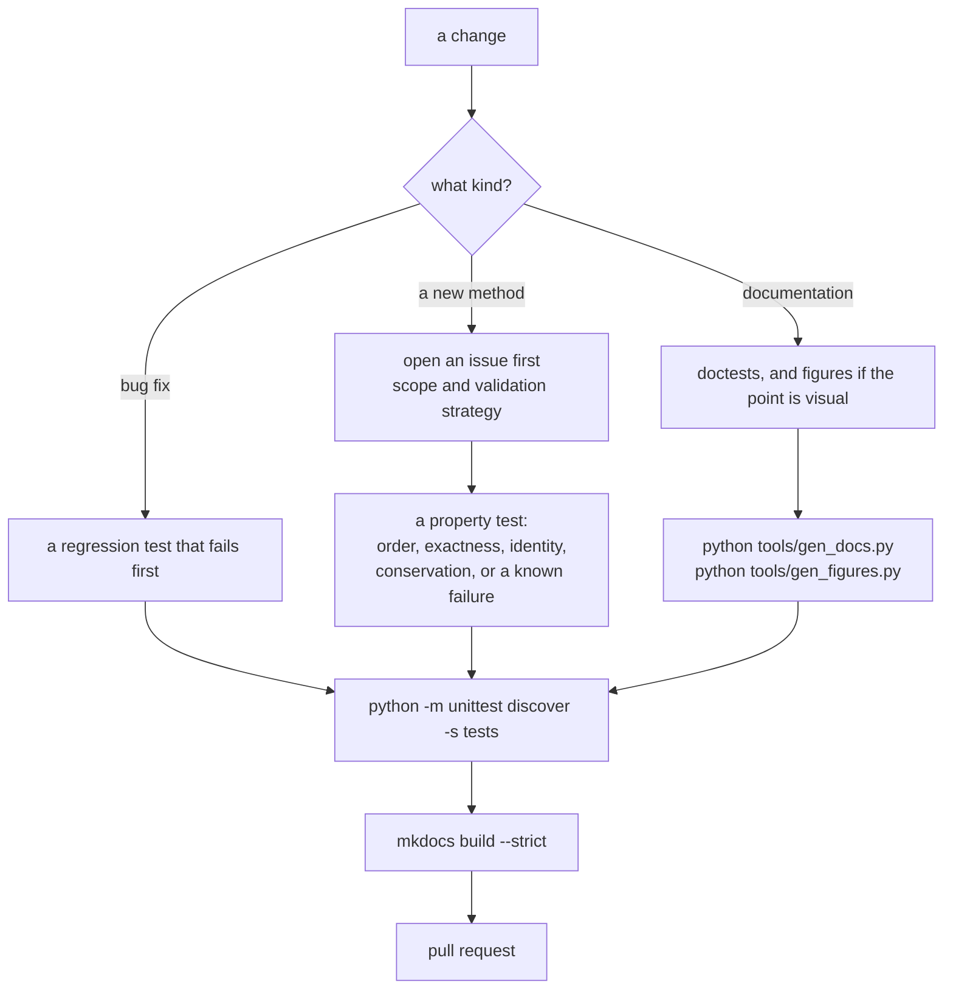

# Contributing

The full contributor guide lives in
[CONTRIBUTING.md](https://github.com/ssmmkk123/quadrivium/blob/main/CONTRIBUTING.md)
in the repository. This page is the short version, plus the parts specific to
the documentation.

## Development setup

```bash
git clone https://github.com/ssmmkk123/quadrivium.git
cd quadrivium
python -m venv .venv
source .venv/bin/activate          # Windows: .venv\Scripts\Activate.ps1
python -m pip install -e ".[dev]"
```

The `dev` extra installs the test, documentation, and packaging tools
together.

## Running the tests

```bash
python -m unittest discover -s tests      # the whole suite
python -m unittest tests.test_calculus    # one module
python -m pytest                          # same suite under pytest
```

CI runs the suite on Python 3.9 through 3.14 and must pass on every version.



## What a numerical change needs

A single expected value is not evidence that an algorithm is right. Add a test
for a property the theory guarantees:

- a **convergence order** — halve the step, check the error ratio;
- an **exactness** result — a Gauss rule on a polynomial of degree `2n − 1`;
- a **conservation law** or a structural identity;
- a **known failure mode** reproduced deliberately;
- agreement with an **independent analytic solution**.

Include the difficult cases, and document what the method cannot do — see
[Known limitations](limitations.md) for the standard.

Keep the algorithm visible in the source. NumPy may supply array operations
and low-level primitives; it must not supply the method.

## Working on the documentation

The site is built with [MkDocs](https://www.mkdocs.org) and Material:

```bash
mkdocs serve      # live reload at http://127.0.0.1:8000
mkdocs build      # render into site/
```

Four rules keep these pages honest, and the test suite enforces all four:

**Every example is executed.** Examples are written as doctests, and
`tests/test_docs.py` runs every one on every documentation page. An example
that no longer produces the output shown fails the suite.

```pycon
>>> import quadrivium as qd
>>> round(qd.brent(lambda x: x**2 - 2, 0, 2).root, 10)
1.4142135624

```

Because doctest compares printed output exactly, convert NumPy scalars with
`float()`, `int()`, or `bool()` before displaying them, and round to fewer
digits than the method actually delivers.

**The API reference is generated.** `docs/api/*.md` comes from the installed
package. After changing any public signature or docstring, regenerate it:

```bash
python tools/gen_docs.py
```

`python tools/gen_docs.py --check` verifies the checked-in pages match the
code, and the test suite fails if they do not — on every supported Python, so
the generator's output has to be interpreter-independent. That is why it reads
annotations as source text rather than evaluating them: `Optional[float]`
evaluates to a `typing` object whose `repr` changed in 3.14, which would make
the pages depend on the version that generated them.

**Every figure is generated from the library.** The pictures under
`docs/assets/figures` are drawn by `tools/gen_figures.py`, which runs the
methods being illustrated and plots what they return. Nothing is drawn by
hand, so a figure cannot claim something the code does not do.

```bash
python -m pip install -e ".[figures]"        # Matplotlib, for this tool only
python tools/gen_figures.py                  # rewrite every figure
python tools/gen_figures.py --only "^ode-"   # just the ones you changed
python tools/gen_figures.py --check          # are the checked-in ones current?
python tools/gen_figures.py --only "^pde-" --png /tmp/preview   # for a look
```

Each figure is a function in `tools/figures/<page>.py` decorated with
`@figure(name, page, summary)`, and is rendered twice — once for the light
theme and once for the dark — because an image cannot see the theme the reader
chose. Embed both, and Material shows the right one:

```markdown
<figure markdown="span">
  
  
  <figcaption>What to look at, and what it means.</figcaption>
</figure>
```

The test suite checks that both variants exist, that every figure is shown on
the page it was registered for, and that no figure is left unreferenced. It
does not re-render them: byte-identical SVG output depends on the Matplotlib
version, so `--check` is a local tool rather than a CI gate.

**The navigation must resolve.** Every page in `mkdocs.yml` must exist, and
every internal link must point at a real file.

## Pull requests

Explain the problem, the approach, and how you validated the result. Keep each
pull request to one coherent change, and add a regression test for every bug
fix. By contributing you agree that your work is licensed under the project's
[MIT License](https://github.com/ssmmkk123/quadrivium/blob/main/LICENSE).
