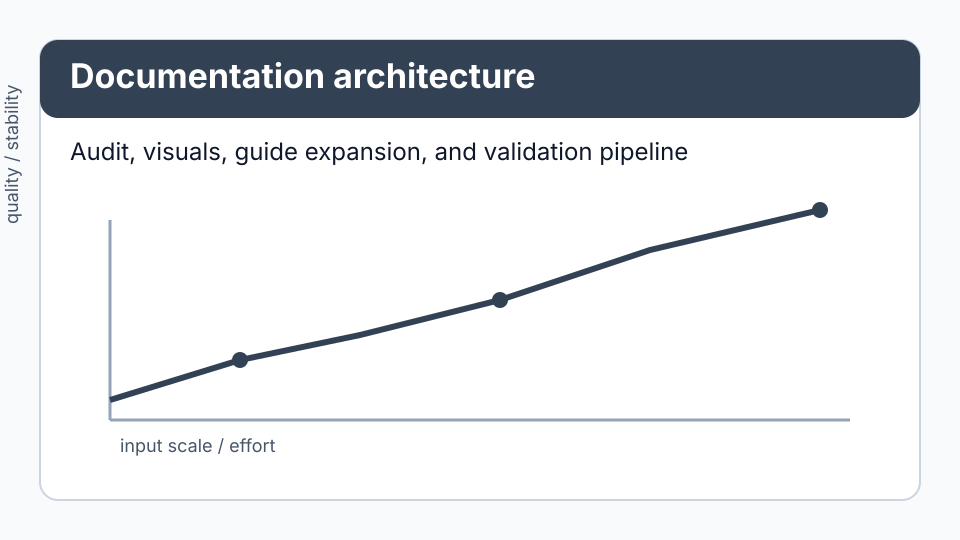

# Documentation visual architecture and standards

## Asset architecture

*Figure: Documentation assets are organized as static, versioned files and validated in test/CI workflows.*

Directory layout:

- `docs/assets/figures/core/` — core-site conceptual figures
- `docs/assets/figures/guides/` — per-guide method and behavior visuals
- `docs/assets/figures/examples/` — one summary figure per runnable example script
- `docs/assets/figures/faq/` — compact support/decision visuals
- `docs/assets/figures/process/` — documentation process and governance visuals

## Visual standards

Every visual should:

1. Use descriptive alt text (never empty).
2. Include a nearby caption that states what decision or interpretation it supports.
3. Label axes and include units/scales when quantitative.
4. Use consistent color coding for comparable semantics (method families, error, stability, constraints).
5. Meet contrast expectations for light/dark themes.
6. Avoid hidden assumptions; call out fixed parameters in the caption.
7. Prefer deterministic, in-repo, static assets to keep builds reproducible.

## Figure types used in this overhaul

- Method-selection charts
- Convergence and error trend plots
- Stability/failure-boundary figures
- Benchmark summary visuals
- Reproducibility checklist figures

## Maintenance expectations

- Any new guide section with method selection should include a matching visual.
- Images must be referenced by at least one page (no orphan assets).
- If a visual is replaced, update all referencing pages in the same change.
- Keep generated API docs (`docs/api/*.md`) untouched except through `python tools/gen_docs.py`.
