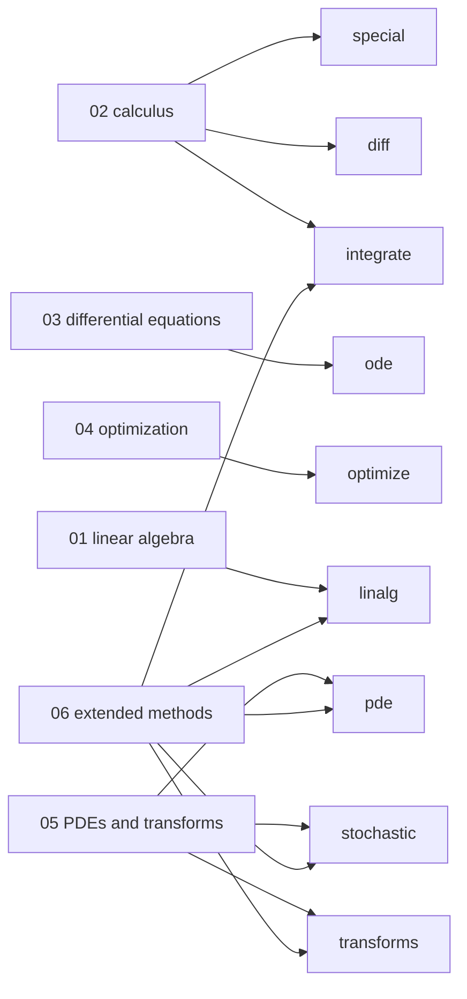

# Example scripts

Six runnable scripts in [`examples/`](https://github.com/ssmmkk123/quadrivium/tree/main/examples)
tour the library end to end. Each prints a numbered sequence of demonstrations
with the numbers that justify them — convergence ratios, residual norms,
iteration counts — so the output is the argument, not decoration.

They need only quadrivium and NumPy, run in a few seconds each, and print to the
terminal without plotting anything.

```bash
git clone https://github.com/ssmmkk123/quadrivium.git
cd quadrivium
python examples/01_linear_algebra.py
```

Each script inserts the repository root on `sys.path`, so they run from a
clone without installing anything.



## 01 — Linear algebra

*~4 seconds.* Factorizations reconstructing their matrix exactly; the four QR
algorithms differing in orthogonality but not in the product; eigenvalues by
five routes; Krylov solvers on a sparse Poisson matrix; the four sparse
storage formats; least squares four ways.

## 02 — Calculus

*under a second.* The finite-difference step-size dilemma and three ways
around it (Richardson, complex step, automatic differentiation); quadrature
convergence orders measured; the cost of reaching machine precision compared
across rules; integrands that defeat ordinary rules — endpoint singularities,
oscillation, poles; high-dimensional Monte Carlo with its variance reductions;
special functions.

## 03 — Differential equations

*~4 seconds.* Convergence orders on a linear test problem; adaptive step size
control; stiffness and where explicit methods fail; L-stability damping a very
stiff transient; symplectic integrators conserving structure over long times;
exponential integrators for semilinear problems; boundary value problems; and
the Lorenz system.

## 04 — Optimization

*~6 seconds.* Rosenbrock from the classic hard starting point across every
method; line searches and why the curvature condition matters; global
optimization on a landscape full of local minima; constrained optimization;
sparse recovery comparing L1 with L2 regularization; linear programming;
nonlinear least squares with uncertainty estimates.

## 05 — PDEs and transforms

*~5 seconds.* The heat equation showing conditional against unconditional
stability; Godunov's theorem in action; shock capturing for Burgers'
equation; discretization order and solver cost for elliptic problems;
multigrid converging independently of the mesh; finite elements and finite
volumes; spectral methods; transforms; random number generation and MCMC.

## 06 — Extended methods

*~7 seconds.* Milstein at strong order 1; Gillespie's SSA as an exact
simulation rather than a discretization; wavelet reconstruction and denoising;
matrix equations in `O(n³)` instead of `O(n⁶)`; randomized SVD attaining the
Eckart-Young optimum; extrapolation; event location as accurate as the
integrator; Anderson acceleration; WENO5 capturing a shock without
oscillation; the Ghia lid-driven cavity benchmark; quadrature for problems
ordinary rules cannot touch; special functions checked by their own
identities.

## See also

- The [guides](guides/linalg.md) explain the same material with the reasoning
  spelled out.
- The [test suite](https://github.com/ssmmkk123/quadrivium/tree/main/tests) is
  the other place to read worked usage — 341 tests, each checking a property
  rather than a stored value.
