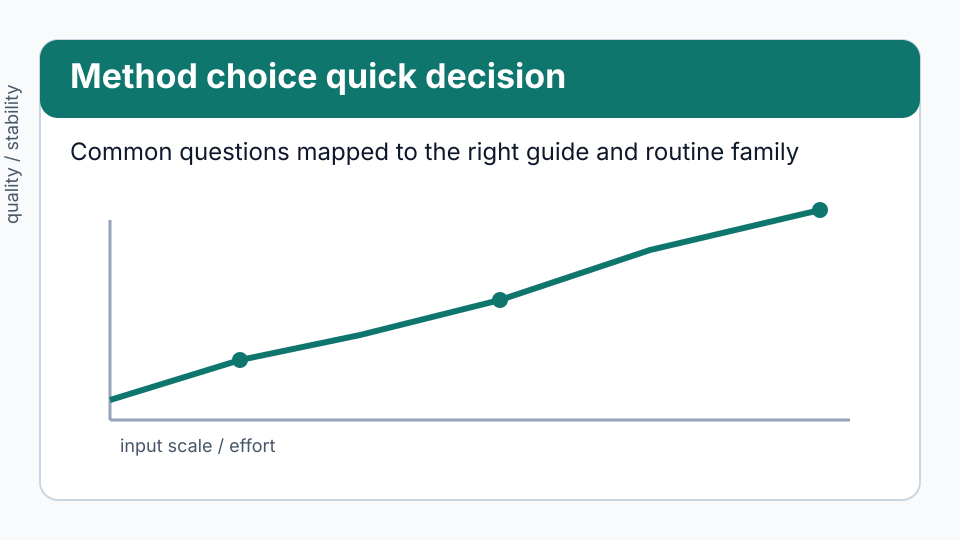
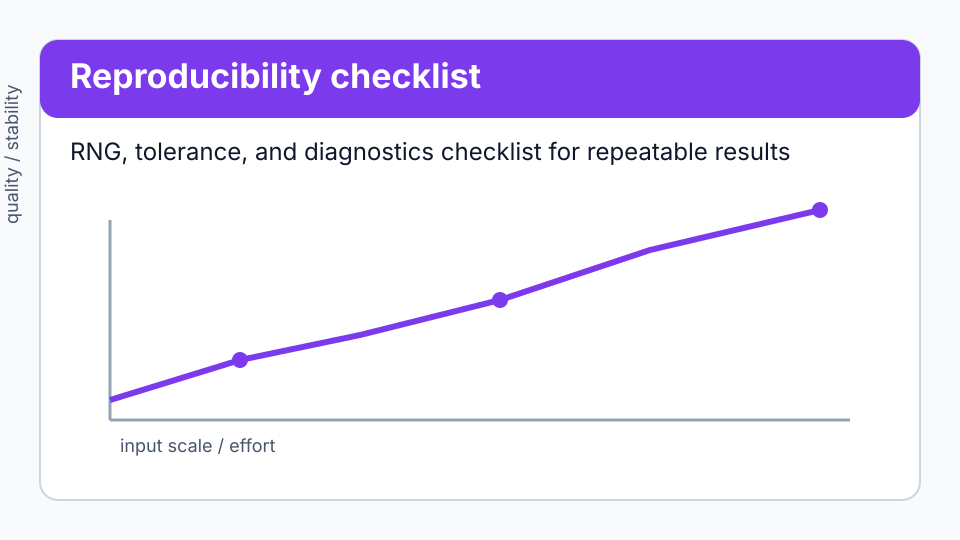

# Frequently asked questions

## Quick decision visuals



*Figure: A compact route from common questions to the right guide/API entry point.*



*Figure: Checklist for reproducible runs across stochastic and deterministic routines.*

## Should I use this instead of SciPy?

For production numerics on large problems, no — use SciPy, which wraps decades
of tuned Fortran and C. Use quadrivium when you want to *see* the method, when
you want the iteration history and the diagnostics rather than just the answer,
or when you need one of the many methods a general-purpose library does not
expose: Bairstow's method, Sturm sequences, ITP, Filon quadrature, Hadamard
finite parts, PEFRL, adaptive rejection sampling, the dual lattice spectral
test.

The two coexist happily: everything here takes and returns NumPy arrays.

## Does it depend on anything besides NumPy?

No. NumPy 1.20 or newer is the only runtime dependency, and there is no
compiled code, so installation is a single pure-Python wheel on every platform.

## Which Python versions are supported?

3.9 through 3.14, all tested in CI on every push.

## How fast is it?

Slower than a compiled library, by a factor that depends on the shape of the
work — small for quadrature and optimization where your own callback dominates,
large (10–100×) for ODE and PDE time stepping, which loops in Python once per
step. [Performance](getting-started.md#performance) gives the breakdown.

## Why did my solve return `converged=False` instead of raising?

By design. A method that runs out of iterations still has a best estimate, an
iteration history, and a residual, and those are usually what tells you what
went wrong. Check `result.converged` and read `result.message`. Exceptions are
reserved for input that cannot be worked with at all — see
[how failure is reported](getting-started.md#how-failure-is-reported).

## How do I make a stochastic result reproducible?

Pass `rng=` — an integer seed or a `numpy.random.Generator`. Every routine that
uses randomness accepts it, and the same seed gives the same answer.

```pycon
>>> import quadrivium as qd
>>> a = qd.monte_carlo(lambda x: x**2, 0, 1, n=1000, rng=42)
>>> b = qd.monte_carlo(lambda x: x**2, 0, 1, n=1000, rng=42)
>>> float(a) == float(b)
True

```

## Which method should I use for X?

Each guide opens with a table that maps a situation to a method:
[linear systems and eigenvalues](guides/linalg.md),
[roots](guides/rootfind.md), [interpolation](guides/interpolate.md),
[fitting](guides/approx.md), [derivatives](guides/diff.md),
[integrals](guides/integrate.md), [ODEs](guides/ode.md),
[PDEs](guides/pde.md), [optimization](guides/optimize.md),
[transforms](guides/transforms.md), [randomness](guides/stochastic.md),
[special functions](guides/special.md).

## Do I have to supply a gradient or Jacobian?

No. Every routine that can use one falls back to a finite-difference
approximation. Supplying the exact derivative is faster and more accurate — the
`function_calls` field will show you by how much — and
[`quadrivium.diff`](guides/diff.md) can compute it exactly by automatic
differentiation.

## Are the results NumPy arrays?

Yes. Inputs may be lists or tuples and are converted internally; outputs are
`numpy.ndarray`. The result records are plain dataclasses, so
`dataclasses.asdict` serializes them and `matplotlib` plots their fields
directly.

## Can I import just one subpackage?

Yes: `from quadrivium.linalg import householder_qr`. Importing `quadrivium`
imports all thirteen subpackages, which takes a fraction of a second and no
meaningful memory.

## How do I cite this?

There is no paper. Cite the repository and the version you used:

```text
Quadrivium 1.1.0. https://github.com/ssmmkk123/quadrivium
```

## Why is the answer's last digit different from SciPy's?

Different algorithms, different orderings, different roundings — agreement to
the last bit is not expected between independent implementations. If a result
differs by more than the tolerance you asked for, that is worth
[reporting](https://github.com/ssmmkk123/quadrivium/issues).

## How do I contribute a method?

Read [Contributing](contributing.md). The short version: open an issue first
for anything substantial, keep the algorithm visible in the source, and test
it against a property — a convergence order, an exactness result, an identity —
rather than against a value the code itself produced.
