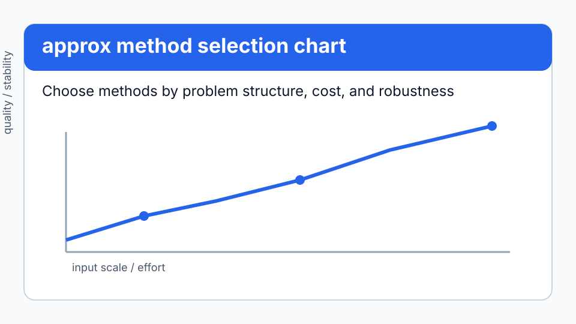
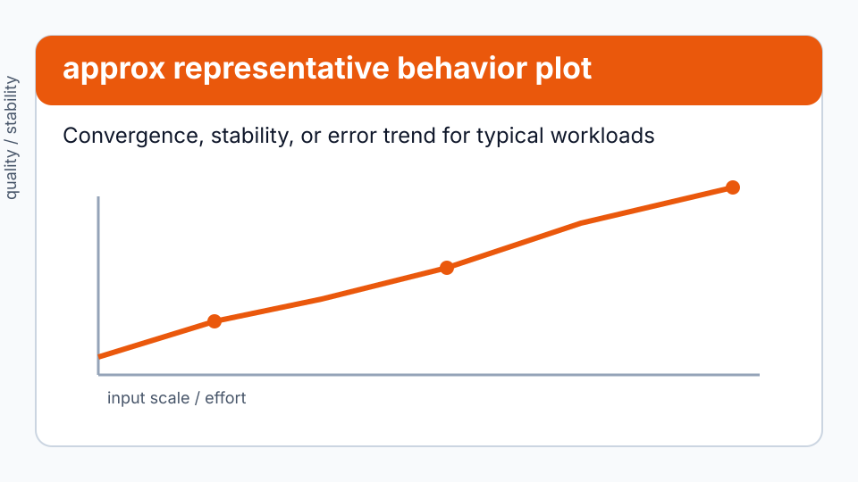

# Approximation

```python
from quadrivium.approx import remez, pade, aaa, gauss_legendre_nodes
import quadrivium as qd          # qd.polyfit, qd.chebyshev_fit, qd.legendre, ...
```

## Problem framing

Use this guide when the main challenge is selecting robust `approx` routines for a specific numerical workload while balancing stability, accuracy, and cost.


38 routines in two groups: orthogonal polynomials with their Gauss quadrature
nodes, and fitting — least squares, minimax, rational, and Fourier. Full
signatures are in the [`approx` reference](../api/approx.md).

Approximation differs from [interpolation](interpolate.md) in what it promises:
an interpolant passes through every point, an approximation minimises an error
measure over the whole interval. Which measure — least squares, uniform,
weighted — is the choice this subpackage is organised around.

## Fitting data

```pycon
>>> import numpy as np
>>> import quadrivium as qd
>>> x = np.array([0.0, 1.0, 2.0, 3.0])
>>> y = x**2 + x + 1
>>> [round(float(c), 10) for c in qd.polyfit(x, y, degree=2)]
[1.0, 1.0, 1.0]

```

Coefficients come back highest degree first, so `numpy.polyval` evaluates them.

| Data or goal | Function |
| --- | --- |
| polynomial least squares | `polyfit` |
| known per-point variances | `weighted_polyfit` |
| high degree, needs conditioning | `chebyshev_fit`, `legendre_fit` |
| `y = a·e^{bx}` | `exponential_fit` |
| `y = a·x^b` | `power_fit` |
| `y = a + b·ln x` | `logarithmic_fit` |
| a ratio of polynomials | `rational_fit`, `aaa` |
| periodic data | `trigonometric_fit`, `fourier_series` |
| smooth curve through noisy data | `spline_fit` |

Above degree six or so, fitting in the monomial basis loses digits to
conditioning — the Vandermonde matrix of a fine grid has a condition number
that grows exponentially in the degree. Fitting in an orthogonal basis does
not:

```pycon
>>> t = np.linspace(-1, 1, 200)
>>> vals = np.exp(t)
>>> cheb = qd.chebyshev_fit(t, vals, degree=12)
>>> float(np.max(np.abs(cheb(t) - vals))) < 1e-12
True

```

## Orthogonal polynomials

Six families, each evaluated by its stable three-term recurrence rather than by
an explicit formula:

```pycon
>>> from quadrivium.approx import legendre, chebyshev_t, hermite_physicists, laguerre
>>> round(float(legendre(3, 0.5)), 12)             # P₃(x) = (5x³ - 3x)/2
-0.4375
>>> round(float(chebyshev_t(5, np.cos(0.7))), 12) == round(float(np.cos(5 * 0.7)), 12)
True

```

Orthogonality is the property they are for, and it holds numerically:

```pycon
>>> from quadrivium.approx import gauss_legendre_nodes
>>> nodes, weights = gauss_legendre_nodes(20)
>>> inner = float(np.sum(weights * legendre(3, nodes) * legendre(5, nodes)))
>>> abs(inner) < 1e-14                             # ⟨P₃, P₅⟩ = 0
True
>>> norm = float(np.sum(weights * legendre(3, nodes)**2))
>>> abs(norm - 2/7) < 1e-14                        # ⟨P₃, P₃⟩ = 2/(2n+1)
True

```

`recurrence_coefficients` gives the three-term coefficients for any family, and
`golub_welsch` turns them into quadrature nodes and weights by solving a
symmetric tridiagonal eigenproblem — the algorithm behind every
`gauss_*_nodes` function here:

| Nodes | Weight function | Interval |
| --- | --- | --- |
| `gauss_legendre_nodes` | `1` | `[a, b]` |
| `gauss_chebyshev_nodes` | `1/√(1−x²)` | `[−1, 1]` |
| `gauss_hermite_nodes` | `e^{−x²}` | `(−∞, ∞)` |
| `gauss_laguerre_nodes` | `x^α e^{−x}` | `[0, ∞)` |
| `gauss_jacobi_nodes` | `(1−x)^α(1+x)^β` | `[−1, 1]` |
| `gauss_lobatto_nodes` | `1`, endpoints included | `[a, b]` |
| `gauss_radau_nodes` | `1`, one endpoint included | `[a, b]` |

`orthogonal_series_fit` expands a function in any of these families directly.

## Minimax approximation

Least squares minimises the average error; the minimax (uniform) polynomial
minimises the worst error, which is what you want when the approximation
carries a guarantee. The Remez exchange algorithm computes it, and the answer
is characterised by equioscillation — the error attains its maximum magnitude
with alternating sign at `degree + 2` points:

```pycon
>>> from quadrivium.approx import remez
>>> best = remez(np.exp, 4, -1, 1)
>>> grid = np.linspace(-1, 1, 2001)
>>> err = best(grid) - np.exp(grid)
>>> minimax_error = float(np.max(np.abs(err)))
>>> ls = qd.polyfit(grid, np.exp(grid), degree=4)
>>> ls_error = float(np.max(np.abs(np.polyval(ls, grid) - np.exp(grid))))
>>> minimax_error < ls_error          # smaller worst-case, by construction
True

```

`chebyshev_economization` is the cheap approximation to the same idea: expand
in Chebyshev polynomials, drop the highest terms, and the error added is
exactly the size of the dropped coefficients, spread evenly.

## Rational approximation

A rational function approximates far better than a polynomial of the same total
degree when the target has poles or steep gradients. Padé matches a Taylor
series term for term:

```pycon
>>> from quadrivium.approx import pade, pade_evaluate
>>> taylor = [1.0, 1.0, 0.5, 1/6, 1/24]            # e^x to x⁴
>>> num, den = pade(taylor, 2, 2)
>>> at = 0.5
>>> pade_err = abs(float(pade_evaluate(num, den, at)) - float(np.exp(at)))
>>> taylor_err = abs(float(np.polyval(taylor[::-1], at)) - float(np.exp(at)))
>>> pade_err < taylor_err / 3          # same coefficients, better answer
True

```

Padé is a local approximation, built from derivatives at one point. For a
global one from sampled values, AAA is the modern method: it places its support
points greedily where the error is worst and keeps everything in barycentric
form, which stays stable where an explicit ratio of polynomials would not:

```pycon
>>> from quadrivium.approx import aaa
>>> z = np.linspace(-1.2, 1.2, 400)
>>> r, support, values, weights = aaa(np.tan, z, tol=1e-12)
>>> float(np.max(np.abs(r(z) - np.tan(z)))) < 1e-10
True
>>> len(support) < 25                              # few terms for that accuracy
True

```

## Fourier approximation

```pycon
>>> from quadrivium.approx import fourier_series
>>> square = lambda t: np.sign(np.sin(t))
>>> approx = fourier_series(square, n=25)
>>> abs(float(approx(1.0)) - 1.0) < 0.1            # away from the jump
True

```

The Gibbs phenomenon is real and does not go away with more terms — the
overshoot at a jump converges to about 9% of the jump height however many
harmonics you add. `trigonometric_fit` fits harmonics to sampled data, and
`fourier_coefficients` returns the coefficients themselves.

## Visual evidence



*Figure: Method-selection map for `approx` routines by problem class and constraints. See the [approx API reference](../api/approx.md).* 



*Figure: Representative behavior (convergence, error, or stability trend) for key `approx` methods.*

## Pitfalls

- **Least squares in the monomial basis is ill-conditioned.** Use
  `chebyshev_fit` or `legendre_fit` above degree six.
- **Minimax is not always what you want.** It is the right criterion when a
  worst-case bound matters; least squares is right when the data is noisy.
- **Padé approximants can have spurious poles** inside the region of interest,
  from near-cancellation in the coefficients. Check the denominator's roots
  (`qd.polynomial_roots`), or use `aaa`, which is built to avoid them.
- **A truncated Fourier series overshoots at jumps.** No number of terms fixes
  it; filter the coefficients or accept the ringing.
- **Extrapolation is not approximation.** Every method here is fitted on an
  interval and says nothing outside it.

## API links

- [`quadrivium.approx` API overview](../api/approx.md)
- [API index](../api/index.md)

## Next steps

- Start with one representative problem and validate with the diagnostics shown in this guide.
- Compare at least two candidate methods from the selection table before scaling up.
- Follow links to neighboring guides when the problem mixes multiple method families.

## See also

- [`approx` API reference](../api/approx.md) — every signature.
- [Interpolation guide](interpolate.md) — passing through the points exactly.
- [Integration guide](integrate.md) — the Gauss rules these nodes drive.
- [Transforms guide](transforms.md) — the FFT route to Fourier coefficients.
