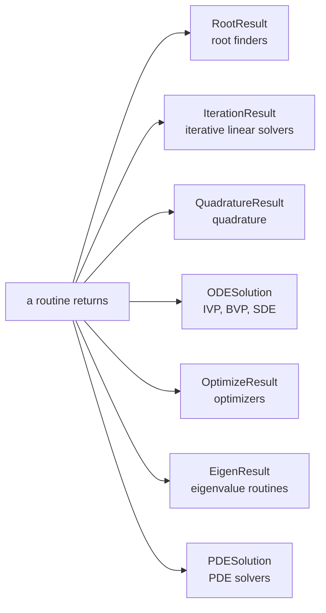
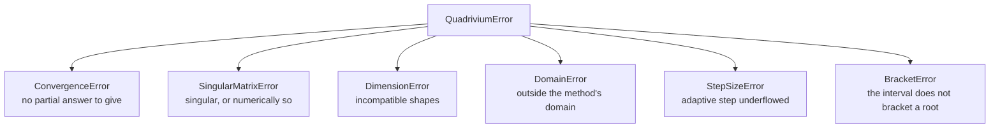

# Core

```python
from quadrivium.core import norm, condition_number, CountedFunction
import quadrivium as qd          # every core name is re-exported at the top level
```

35 names shared by everything else: the result records solvers return, the
exception hierarchy they raise, norms and conditioning, shape and property
checks, and numerical derivatives. Full signatures are in the
[`core` reference](../api/core.md).

Unlike the other subpackages, `core` is not a topic — it is the vocabulary the
rest of the library is written in. Everything here is re-exported at the top
level.

## Result records

Seven dataclasses. Which one a routine returns is fixed by the kind of problem
it solves, so `qd.brent` and `qd.newton` return the same shape of answer even
though they work differently.

| Record | Returned by | Answer |
| --- | --- | --- |
| `RootResult` | root finders | `root` (aliased `x`) |
| `IterationResult` | iterative linear solvers | `x` |
| `QuadratureResult` | quadrature rules | `value` |
| `ODESolution` | IVP, BVP, and SDE solvers | `t`, `y`, `y_final` |
| `OptimizeResult` | optimizers | `x`, `fun` |
| `EigenResult` | eigenvalue routines | `eigenvalues`, `eigenvectors` |
| `PDESolution` | PDE solvers | `u`, `grids`, `t` |

Each carries the diagnostics for its kind of method — see
[Result records](../getting-started.md#result-records) for the full field
lists. Three of them behave like the value they hold:



```pycon
>>> from quadrivium import numeric as np
>>> import quadrivium as qd
>>> float(qd.quad(lambda x: x**2, 0, 1))              # QuadratureResult → float
0.3333333333333323
>>> values, vectors = qd.jacobi_eigen(np.eye(2))      # EigenResult unpacks
>>> sorted(float(v) for v in values)
[1.0, 1.0]
>>> sol = qd.solve_ivp(lambda t, y: -y, (0, 1), [1.0], rtol=1e-10)
>>> float(sol(0.25)[0]) > 0                            # ODESolution is callable
True

```

They are plain dataclasses, so `dataclasses.asdict`, `replace`, and equality
all work as expected.

## Exceptions

```pycon
>>> from quadrivium.core import (QuadriviumError, ConvergenceError, DomainError,
...                             SingularMatrixError, DimensionError,
...                             StepSizeError, BracketError)
>>> all(issubclass(e, QuadriviumError) for e in
...     (ConvergenceError, DomainError, SingularMatrixError,
...      DimensionError, StepSizeError, BracketError))
True

```

The library raises only for input it cannot work with — a singular matrix, a
bracket that does not bracket, an argument outside a function's domain.
Failure to converge is reported in the result record instead, with
`converged=False` and a message. `ConvergenceError` exists for the routines
that have no partial answer to give, and it carries `iterations`, `residual`,
and `best` so even that path keeps what was computed.



One `except QuadriviumError` therefore catches everything the library throws,
and nothing it merely reports.

## Norms and conditioning

```pycon
>>> from quadrivium.core import norm, matrix_norm, condition_number
>>> v = np.array([3.0, -4.0])
>>> norm(v), norm(v, 1), norm(v, np.inf)
(5.0, 7.0, 4.0)
>>> A = np.array([[1.0, 2.0], [3.0, 4.0]])
>>> round(condition_number(A), 6)
14.933034

```

`norm(x, p)` takes any positive `p` as well as `inf`; `matrix_norm` supports
the 1, 2, Frobenius and infinity norms; `condition_number` uses the 2-norm by
default. For a large matrix, `quadrivium.linalg.condition_estimate` gives
Hager's 1-norm estimate without forming an inverse.

<figure markdown="span">
  
  
  <figcaption>`norm(x, p)` accepts any positive p, and the shape of the unit ball is what the choice means: the 1-norm's diamond is why an L1 penalty produces sparse answers, and every p-norm approaches the infinity norm as p grows.</figcaption>
</figure>

`relative_error` and `absolute_error` are the obvious two, with the guard that
matters:

```pycon
>>> from quadrivium.core import relative_error, absolute_error
>>> round(relative_error(2.0001, 2.0), 8), absolute_error(2.0001, 2.0)
(5e-05, 0.00010000000000021103)

```

<figure markdown="span">
  
  
  <figcaption>For the Hilbert matrix, κ·ε is not a loose bound: the measured error of a least squares solve tracks it across sixteen orders of magnitude. This is what `condition_number` is for — knowing how much of the answer to believe before computing it.</figcaption>
</figure>

## Shape and property checks

```pycon
>>> from quadrivium.core import (as_vector, as_matrix, check_square, is_symmetric,
...                             is_positive_definite, is_diagonally_dominant)
>>> as_vector([1, 2, 3]).dtype
dtype('float64')
>>> S = np.array([[4.0, 1.0], [1.0, 3.0]])
>>> is_symmetric(S), is_positive_definite(S), is_diagonally_dominant(S)
(True, True, True)

```

These are what `qd.solve` consults when choosing a factorization, and they are
public because the same question — is this matrix suitable for Cholesky? — is
one you will want to ask before choosing a method yourself.

## Machine constants

```pycon
>>> from quadrivium.core import EPS, SQRT_EPS, machine_epsilon, unit_roundoff
>>> EPS == float(np.finfo(float).eps)
True
>>> SQRT_EPS
1.4901161193847656e-08
>>> unit_roundoff()
1.1102230246251565e-16

```

`SQRT_EPS` is the natural step size for a forward difference and `EPS**(1/3)`
for a central one, which is why both constants appear throughout the library's
defaults.

## Numerical derivatives

Finite-difference derivatives used internally wherever an analytic derivative
was not supplied. They are public so a method can be given the same
approximation deliberately:

```pycon
>>> from quadrivium.core import numerical_gradient, numerical_hessian, numerical_jacobian
>>> f = lambda v: v[0]**2 + 3*v[1]**2
>>> [round(float(g), 6) for g in numerical_gradient(f, [1.0, 2.0])]
[2.0, 12.0]
>>> numerical_hessian(f, [1.0, 2.0]).round(4).tolist()
[[2.0, 0.0], [0.0, 6.0]]

```

For exact derivatives instead of approximate ones, use the automatic
differentiation in [`quadrivium.diff`](diff.md).

## Counting function calls

`CountedFunction` wraps a callable and counts its evaluations. It is how every
routine reports `function_calls`, and it is useful directly when comparing
methods:

```pycon
>>> from quadrivium.core import CountedFunction
>>> counted = CountedFunction(lambda x: x**2 - 2)
>>> r = qd.brent(counted, 0, 2)
>>> counted.calls == r.function_calls
True

```

`wrap_scalar_function` adapts a scalar callable to the vector interface the
multivariate routines expect.

## See also

- [`core` API reference](../api/core.md) — every signature.
- [Getting started](../getting-started.md) — the conventions these types
  implement.
- [Differentiation guide](diff.md) — exact derivatives instead of differences.
