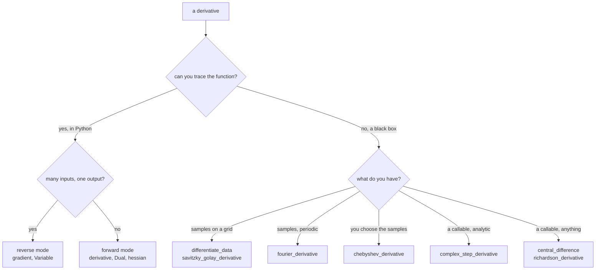

# Differentiation

```python
from quadrivium.diff import Dual, Variable, fornberg_weights, chebyshev_derivative
import quadrivium as qd          # qd.derivative, qd.gradient, qd.hessian, ...
```

41 routines in three families that differ in what they cost and what they can
promise: finite differences (approximate, work on anything), automatic
differentiation (exact, needs a traceable function), and spectral
differentiation (exact for smooth periodic or Chebyshev-sampled data). Full
signatures are in the [`diff` reference](../api/diff.md).

## Which family

| You have | Use | Accuracy |
| --- | --- | --- |
| a Python function you can call | `derivative`, `gradient`, `hessian` (forward AD) | exact to machine precision |
| a black box (compiled, noisy, or a simulation) | `central_difference`, `gradient_fd` | `O(h²)`, limited by roundoff |
| an analytic function and want one clean derivative | `complex_step_derivative` | exact, no subtraction error |
| a smooth function and want many derivatives cheaply | `richardson_derivative` | high order by extrapolation |
| a scalar function and want a gradient *and* a Hessian | `hessian` (hyper-dual) | exact |
| a many-input, one-output function | reverse mode: `Variable` | exact, one pass |
| samples on a grid | `differentiate_data`, `savitzky_golay_derivative` | `O(hᵖ)`, noise-tolerant |
| samples of a periodic function | `fourier_derivative` | spectral |
| a function you may sample where you like | `chebyshev_derivative` | spectral |



## Automatic differentiation

Forward mode carries a derivative alongside every value. `Dual` numbers do it
for one variable, so the derivative comes out exact — no step size, no
truncation error, no cancellation:

```pycon
>>> import numpy as np
>>> import quadrivium as qd
>>> from quadrivium.diff import Dual
>>> x = Dual(2.0, 1.0)               # value 2, derivative of x with respect to x
>>> y = x * x * x + 2 * x
>>> y.value, y.deriv                 # x³+2x = 12, 3x²+2 = 14
(12.0, 14.0)

```

`derivative`, `gradient`, and `jacobian` wrap that up:

```pycon
>>> round(qd.derivative(lambda t: np.sin(t) * np.exp(t), 1.0), 12)
3.756049227095
>>> f = lambda v: v[0]**2 * v[1] + v[1]**3
>>> [round(float(g), 10) for g in qd.gradient(f, [2.0, 3.0])]
[12.0, 31.0]

```

`HyperDual` carries two derivative slots at once, which gives exact second
derivatives — a Hessian with no differencing anywhere:

```pycon
>>> H = qd.hessian(lambda v: v[0]**2 * v[1] + v[1]**3, [2.0, 3.0])
>>> H.round(10).tolist()
[[6.0, 4.0], [4.0, 18.0]]

```

Reverse mode (`Variable`) records a tape and walks it backwards, so one
backward pass gives every partial derivative at once. That is the right way
round when there are many inputs and one output — the machine-learning case:

```pycon
>>> from quadrivium.diff import Variable
>>> a, b = Variable(3.0), Variable(4.0)
>>> loss = (a * b + a) * b
>>> loss.backward()
>>> a.grad, b.grad             # ∂/∂a = b²+b = 20, ∂/∂b = 2ab+a = 27
(20.0, 27.0)

```

`value_and_grad` returns both in one call, and `hessian_vector_product`
computes `H·v` without forming `H`.

<figure markdown="span">
  
  
  <figcaption>Evaluations of your function for one gradient, counted with `CountedFunction`. Finite differences cost 2n; forward-mode AD costs n; reverse mode costs one sweep whatever the dimension — and unlike the differences, it is exact.</figcaption>
</figure>

The limit of AD is what it can trace: a function that calls into compiled code,
reads a table, or branches on the value of its input cannot be differentiated
this way. That is when finite differences earn their place.

## Finite differences

The central difference is second order, and its error behaves as advertised —
until roundoff takes over, which is the part worth seeing:

```pycon
>>> from quadrivium.diff import central_difference
>>> exact = float(np.cos(1.0))
>>> for h in (1e-2, 1e-4, 1e-6, 1e-10, 1e-14):
...     err = abs(central_difference(np.sin, 1.0, h=h) - exact)
...     print(f"h={h:<8g} error {err:.2e}")
h=0.01     error 9.00e-06
h=0.0001   error 9.00e-10
h=1e-06    error 2.77e-11
h=1e-10    error 5.85e-08
h=1e-14    error 3.71e-03

```

The error falls as `h²` until about `h = 10⁻⁶`, then rises again as
subtracting two nearly equal numbers destroys the significant digits.
`optimal_step_size` returns the `h` that balances the two effects, and it is
the default the routines use.

<figure markdown="span">
  
  
  <figcaption>Truncation error falls with h and cancellation rises as h shrinks, so every finite difference has a best step and a floor it cannot pass. The complex step avoids the subtraction entirely and hits machine precision; Richardson extrapolation gets most of the way there from a large step.</figcaption>
</figure>

The complex-step derivative avoids the subtraction entirely — there is no
difference of nearby values, so `h` can be made arbitrarily small:

```pycon
>>> from quadrivium.diff import complex_step_derivative
>>> abs(complex_step_derivative(np.sin, 1.0) - exact) < 1e-16
True

```

It needs a function that accepts complex arguments and is analytic — `abs`,
`max`, and comparisons break it.

### Arbitrary stencils

`fornberg_weights` computes finite-difference weights for any derivative order
on any set of nodes, evenly spaced or not. It is the general answer behind
every table of coefficients:

```pycon
>>> from quadrivium.diff import fornberg_weights
>>> W = fornberg_weights(0.0, [-1.0, 0.0, 1.0], max_order=2)
>>> [round(float(v), 10) for v in W[:, 1]]   # first derivative: (-1/2, 0, 1/2)
[-0.5, 0.0, 0.5]
>>> [round(float(v), 10) for v in W[:, 2]]   # second derivative: (1, -2, 1)
[1.0, -2.0, 1.0]

Column `m` holds the weights for the `m`-th derivative, so one call gives the
whole family. The nodes need not be evenly spaced, which is the point:

>>> Wu = fornberg_weights(0.0, [-0.5, 0.0, 2.0], max_order=1)
>>> [round(float(v), 6) for v in Wu[:, 1]]
[-1.6, 1.5, 0.1]

```

`finite_difference_weights(order, accuracy, kind)` is the evenly spaced
special case, and `differentiation_matrix(x, order)` assembles the whole
operator for a grid — including a non-uniform one, which is what makes it
useful for a stretched mesh.

<figure markdown="span">
  
  
  <figcaption>`differentiation_matrix` on 24 uniform points is banded: each row is a local stencil. The Chebyshev matrix on the same number of points is full — every value influences every derivative — which is exactly why it is spectrally accurate and why applying it costs O(n²).</figcaption>
</figure>

### Richardson extrapolation

Combining evaluations at `h`, `h/2`, `h/4`, … cancels the leading error terms
in turn, and buys several digits over the plain difference:

```pycon
>>> plain = abs(central_difference(np.sin, 1.0, h=0.1) - exact)
>>> rich = abs(qd.richardson_derivative(np.sin, 1.0, h=0.1) - exact)
>>> bool(plain > 1e-4 and rich < 1e-12)
True

```

### Noisy data

Differentiating measured data amplifies noise: a difference divides by `h`, so
noise of size `ε` becomes `ε/h`. Savitzky-Golay fits a low-order polynomial to
a moving window and differentiates that instead, which is the standard fix:

```pycon
>>> from quadrivium.diff import savitzky_golay_derivative, differentiate_data
>>> t = np.linspace(0, 2*np.pi, 200)
>>> clean = np.sin(t)
>>> noisy = clean + 1e-3 * np.random.default_rng(0).standard_normal(t.size)
>>> dt = float(t[1] - t[0])
>>> raw = differentiate_data(t, noisy)
>>> smooth = savitzky_golay_derivative(noisy, window=21, poly_order=3, order=1, dx=dt)
>>> raw_err = float(np.max(np.abs(raw - np.cos(t))))
>>> sg_err = float(np.max(np.abs(smooth[10:-10] - np.cos(t)[10:-10])))
>>> sg_err < raw_err / 5
True

```

<figure markdown="span">
  
  
  <figcaption>Noise of size ε in the data becomes noise of size ε/h in a difference quotient. Savitzky-Golay fits a cubic to a moving window of 21 points and differentiates that, trading a little resolution for two orders of magnitude of noise.</figcaption>
</figure>

## Spectral differentiation

For a smooth periodic function sampled on a uniform grid, differentiating the
Fourier interpolant is exact to machine precision — no order, no step size:

```pycon
>>> from quadrivium.diff import fourier_derivative
>>> n = 64
>>> x = np.linspace(0, 2*np.pi, n, endpoint=False)
>>> d = fourier_derivative(np.sin(x), L=2*np.pi)
>>> float(np.max(np.abs(d - np.cos(x)))) < 1e-12
True

```

The same accuracy for a non-periodic function requires Chebyshev points, which
cluster at the endpoints:

```pycon
>>> from quadrivium.diff import chebyshev_derivative, chebyshev_points
>>> xc, dc = chebyshev_derivative(lambda t: np.exp(t), n=32, a=-1, b=1)
>>> float(np.max(np.abs(dc - np.exp(xc)))) < 1e-12
True

```

<figure markdown="span">
  
  
  <figcaption>A fixed-order stencil gains a fixed factor per refinement — a straight line on this log-log plot. The spectral methods gain digits per added point until they reach machine precision, which they do here with fewer than fifty points.</figcaption>
</figure>

Both come apart if the function is not smooth: spectral accuracy is a
statement about analytic functions, and a kink drops it straight back to first
order. `chebyshev_coefficients`, `chebyshev_evaluate`, and `clenshaw` handle
the coefficient side of the same expansion.

## Pitfalls

- **Never pick `h` yourself without a reason.** The optimal step is roughly
  `∛ε` for a central difference of a well-scaled function. Smaller is not
  better; it is worse.
- **Finite-difference Hessians cost `O(n²)` evaluations and lose half the
  digits.** If you can trace the function, use `hessian` instead.
- **Complex step needs analyticity.** It silently returns nonsense for
  functions with `abs`, `min`, `max`, or data-dependent branches.
- **AD differentiates the code you wrote, not the function you meant.** A
  branch on `x > 0` is differentiated on the branch actually taken.
- **Spectral differentiation of a non-periodic function on a uniform grid**
  produces large errors at the boundaries (the Gibbs phenomenon). Use
  Chebyshev points.

## See also

- [`diff` API reference](../api/diff.md) — every signature.
- [Optimization guide](optimize.md) — where these gradients and Hessians go.
- [PDE guide](pde.md) — `differentiation_matrix` and the spectral operators as
  discretizations.
