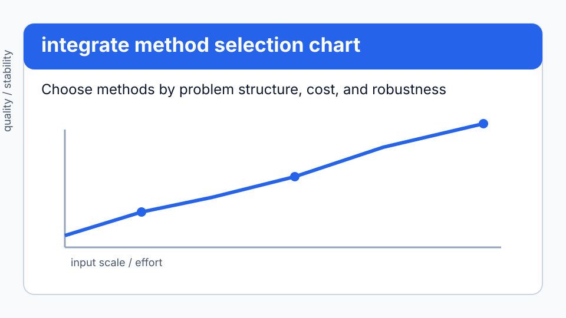
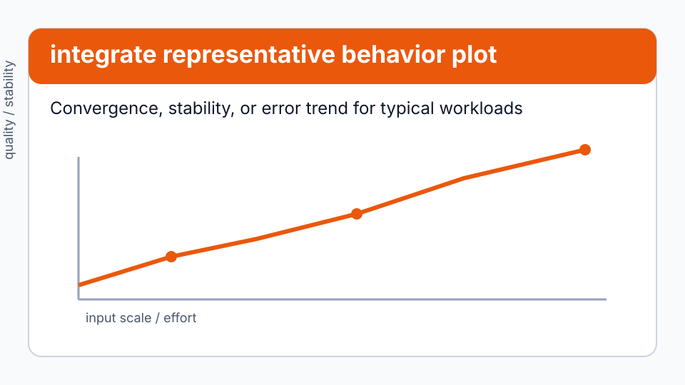

# Integration

```python
from quadrivium.integrate import quad, tanh_sinh, adaptive_gauss_kronrod
import quadrivium as qd          # qd.quad, qd.romberg, qd.monte_carlo, ...
```

## Problem framing

Use this guide when the main challenge is selecting robust `integrate` routines for a specific numerical workload while balancing stability, accuracy, and cost.


66 quadrature rules: the Newton-Cotes family, Gauss rules for six weight
functions, adaptive subdivision, Monte Carlo and quasi-Monte Carlo, rules for
oscillatory and singular integrands, and multidimensional cubature. Full
signatures are in the [`integrate` reference](../api/integrate.md).

Every rule returns a `QuadratureResult`, which converts to `float` directly and
carries an error estimate where the method produces one.

## Start with `quad`

```pycon
>>> import numpy as np
>>> import quadrivium as qd
>>> q = qd.quad(lambda x: np.exp(-x*x), -np.inf, np.inf)
>>> round(float(q), 12) == round(float(np.sqrt(np.pi)), 12)
True
>>> q.error_estimate < 1e-11
True

```

`quad` subdivides adaptively and transforms infinite limits to finite ones, so
it is the right default for a smooth integrand over any interval, finite or
not. Reach past it when you know something it does not.

## Choosing a rule

| Integrand | Use |
| --- | --- |
| smooth, unknown otherwise | `quad` |
| smooth, want a specific node count | `gauss_legendre(f, a, b, n)` |
| smooth and periodic over its period | `trapezoid_rule` — spectrally accurate here |
| smooth, want an error estimate | `adaptive_gauss_kronrod`, `gauss_kronrod` |
| a peak or a kink somewhere | `adaptive_simpson`, `global_adaptive` |
| endpoint singularity (`1/√x`, `log x`) | `tanh_sinh`, `singular_endpoint_quadrature` |
| pole inside the interval | `cauchy_principal_value`, `hadamard_finite_part` |
| oscillatory, `f(x)·sin(ωx)` with large ω | `filon` |
| infinite interval with `e^{-x²}` weight | `gauss_hermite` |
| half-line with `e^{-x}` weight | `gauss_laguerre` |
| `1/√(1-x²)` weight | `gauss_chebyshev` |
| you have data, not a function | `trapezoid_data`, `simpson_data`, `cumulative_trapezoid` |
| 2-D or 3-D box | `double_integral`, `triple_integral`, `tensor_gauss` |
| triangle or tetrahedron | `triangle_quadrature`, `tetrahedron_quadrature` |
| 4 to ~10 dimensions | `sparse_grid_quadrature` (Smolyak) |
| more dimensions than that | `monte_carlo_nd`, `quasi_monte_carlo` |
| an awkward region | `monte_carlo_region` with an indicator |

## Newton-Cotes and its convergence orders

The classical rules are all here, and their orders are exactly what the theory
promises — halving `h` divides the error of the trapezoid rule by 4, Simpson's
by 16, and Boole's by 64:

```pycon
>>> from quadrivium.integrate import trapezoid_rule, simpson_rule, boole_rule
>>> exact = 1 - np.cos(1.0)
>>> for rule in (trapezoid_rule, simpson_rule, boole_rule):
...     coarse = abs(float(rule(np.sin, 0, 1, n=16)) - exact)
...     fine = abs(float(rule(np.sin, 0, 1, n=32)) - exact)
...     print(f"{rule.__name__:16s} error ratio {coarse / fine:5.0f}")
trapezoid_rule   error ratio     4
simpson_rule     error ratio    16
boole_rule       error ratio    64

```

`newton_cotes_weights(n)` gives the weights for any degree, closed or open,
and `newton_cotes` applies them. Above about degree 8 the weights change sign
and the rule becomes unstable — a fact worth seeing rather than being told:

```pycon
>>> from quadrivium.integrate import newton_cotes_weights
>>> nodes, w = newton_cotes_weights(10)
>>> bool(np.any(w < 0))                # negative weights: cancellation ahead
True

```

`romberg` is the trapezoid rule with Richardson extrapolation, which is the
cheapest route to high accuracy on a smooth integrand:

```pycon
>>> r = qd.romberg(np.sin, 0, np.pi)
>>> round(float(r), 12), bool(r.error_estimate < 1e-11)
(2.0, True)

```

`euler_maclaurin` adds the derivative corrections explicitly, and
`romberg_table` returns the whole extrapolation tableau if you want to look at
the columns converging.

## Gauss rules

An `n`-point Gauss-Legendre rule integrates every polynomial of degree
`2n − 1` exactly. That is not an approximation to check loosely — it holds to
machine precision:

```pycon
>>> from quadrivium.integrate import gauss_legendre
>>> round(float(gauss_legendre(lambda x: x**7, 0, 1, n=4)), 12)   # degree 7 = 2·4 - 1
0.125
>>> abs(float(gauss_legendre(lambda x: x**8, 0, 1, n=4)) - 1/9) > 1e-6
True

```

The other weight functions integrate their own family of integrals without
your having to transform anything:

```pycon
>>> from quadrivium.integrate import gauss_hermite, gauss_laguerre
>>> round(float(gauss_hermite(lambda x: x**2, n=20)), 9)      # ∫ x²e^{-x²} dx = √π/2
0.886226925
>>> round(float(gauss_laguerre(lambda x: x**3, n=20)), 10)    # ∫₀^∞ x³e^{-x} dx = 3!
6.0

```

`gauss_lobatto` includes both endpoints (useful when the endpoint values are
already known), `gauss_radau` includes one, and `composite_gauss` applies a
low-order Gauss rule on many panels — the practical choice when the integrand
is smooth in pieces. `clenshaw_curtis` and `fejer` use Chebyshev nodes, which
nest, so refining reuses every evaluation.

## Adaptive rules

Adaptive subdivision spends its points where the integrand is difficult, and
reports how many it needed:

```pycon
>>> spike = lambda x: 1 / (1e-6 + x**2)          # a very narrow peak at 0
>>> exact = float(2 * np.arctan(1e3) * 1e3)
>>> a = qd.adaptive_gauss_kronrod(spike, -1, 1, tol=1e-10)
>>> a.converged, abs(float(a) - exact) / exact < 1e-12
(True, True)

Given the same budget of evaluations, spread uniformly, the peak is missed
almost entirely:

>>> uniform = qd.simpson_rule(spike, -1, 1, n=a.function_calls)
>>> round(abs(float(uniform) - exact) / exact, 2)
0.49

```

`adaptive_simpson` and `adaptive_trapezoid` bisect locally; `global_adaptive`
keeps a queue of subintervals ordered by error estimate and always splits the
worst one, which is more robust when the difficulty is concentrated in one
place.

## Singular and oscillatory integrands

An endpoint singularity defeats every equally spaced rule. The tanh-sinh
(double exponential) transformation handles it, because the transformed
integrand decays doubly exponentially and its endpoint values underflow to
zero rather than blowing up:

```pycon
>>> t = qd.tanh_sinh(lambda x: 1/np.sqrt(x), 0, 1)      # ∫₀¹ x^{-1/2} = 2
>>> round(float(t), 12), bool(t.error_estimate < 1e-13)
(2.0, True)

```

A pole *inside* the interval is not an improper integral you can subdivide
around — it needs a principal value, which is a different quantity:

```pycon
>>> from quadrivium.integrate import cauchy_principal_value, hadamard_finite_part
>>> cpv = cauchy_principal_value(lambda x: 1.0, -1, 1, c=0.0)   # ⨍ dx/x = 0
>>> abs(float(cpv)) < 1e-12
True

```

`hadamard_finite_part` does the same for a double pole, where even the
principal value diverges.

For `f(x)·sin(ωx)` with large ω, an ordinary rule needs points per wavelength;
Filon's method integrates the oscillation analytically and only interpolates
`f`, so its cost does not grow with ω:

```pycon
>>> from quadrivium.integrate import filon
>>> omega = 200.0
>>> osc = (1 - np.cos(omega)) / omega             # ∫₀¹ sin(ωx) dx
>>> bool(abs(float(filon(lambda x: 1.0, 0, 1, omega=omega, kind="sin")) - osc) < 1e-10)
True

```

## Monte Carlo

Monte Carlo converges as `n^{-1/2}` regardless of dimension, which is what
makes it the only option in high dimensions and a poor one in low dimensions.
Every routine takes `rng=` (an integer seed or a `Generator`) and returns a
standard error in `error_estimate`:

```pycon
>>> mc = qd.monte_carlo(lambda x: x**2, 0, 1, n=10_000, rng=0)
>>> abs(float(mc) - 1/3) < 4 * mc.error_estimate
True

```

The variance reduction techniques are separate functions so their effect is
visible:

| Technique | Function | Helps when |
| --- | --- | --- |
| stratification | `stratified_sampling` | the integrand varies smoothly |
| importance sampling | `importance_sampling` | mass is concentrated somewhere |
| control variates | `control_variates` | a correlated integral is known exactly |
| antithetic variates | `antithetic_variates` | the integrand is monotone |
| low-discrepancy points | `quasi_monte_carlo`, `halton_sequence`, `sobol_sequence` | dimension is moderate and `f` is smooth |
| adaptive stratification | `vegas_lite` | the integrand has a peak you cannot locate |

```pycon
>>> from quadrivium.integrate import stratified_sampling, antithetic_variates
>>> plain = qd.monte_carlo(lambda x: x**2, 0, 1, n=4000, rng=1)
>>> strat = stratified_sampling(lambda x: x**2, 0, 1, n=4000, strata=50, rng=1)
>>> strat.error_estimate < plain.error_estimate
True

```

Quasi-Monte Carlo replaces random points with a low-discrepancy sequence and
converges nearly as `n^{-1}` on smooth integrands. It is deterministic, so
there is no error estimate — that is the trade.

## Several dimensions

```pycon
>>> from quadrivium.integrate import double_integral, sparse_grid_quadrature
>>> round(float(double_integral(lambda x, y: x*y, 0, 1, 0, 1)), 12)
0.25

```

The bounds of an inner integral may be functions of the outer variable, which
is how a non-rectangular region is described:

```pycon
>>> tri = double_integral(lambda x, y: 1.0, 0, 1, 0, lambda x: 1 - x)
>>> round(float(tri), 10)                        # area of the unit triangle
0.5

```

Tensor-product rules cost `nᵈ` points and become impossible around six
dimensions. Smolyak sparse grids use a combination of low-order tensor rules
whose cost grows polynomially instead:

```pycon
>>> f3 = lambda p: float(np.sum(np.asarray(p)**2))
>>> s = sparse_grid_quadrature(f3, [0, 0, 0], [1, 1, 1], level=4)
>>> abs(float(s) - 1.0) < 1e-10                  # ∫[0,1]³ (x²+y²+z²) = 1
True

```

## Visual evidence



*Figure: Method-selection map for `integrate` routines by problem class and constraints. See the [integrate API reference](../api/integrate.md).* 



*Figure: Representative behavior (convergence, error, or stability trend) for key `integrate` methods.*

## Pitfalls

- **An error estimate is an estimate.** Adaptive rules estimate the error from
  the difference of two rules on the same interval. An integrand that both
  rules get equally wrong — a narrow spike between the nodes — is reported as
  converged. Subdivide manually, or use `global_adaptive` with a tighter
  tolerance, when the shape is unknown.
- **`float()` on a `QuadratureResult` throws the diagnostics away.** Keep the
  record when you care whether it converged.
- **Newton-Cotes above degree 8 is unstable.** Use a composite low-order rule
  or a Gauss rule instead of a single high-degree one.
- **Monte Carlo error shrinks as `√n`.** One more digit costs a hundred times
  the samples. In one or two dimensions, essentially any deterministic rule is
  better.
- **Infinite limits need the transformation `quad` performs.** Passing a large
  finite number instead silently truncates the tail.

## API links

- [`quadrivium.integrate` API overview](../api/integrate.md)
- [API index](../api/index.md)

## Next steps

- Start with one representative problem and validate with the diagnostics shown in this guide.
- Compare at least two candidate methods from the selection table before scaling up.
- Follow links to neighboring guides when the problem mixes multiple method families.

## See also

- [`integrate` API reference](../api/integrate.md) — every signature.
- [Approximation guide](approx.md) — `gauss_legendre_nodes` and the orthogonal
  polynomials these rules are built from.
- [Stochastic guide](stochastic.md) — the samplers behind the Monte Carlo
  routines.
- `examples/02_calculus.py` — a runnable tour of differentiation and quadrature.
