# Interpolation

```python
from quadrivium.interpolate import pchip, bspline, rbf_interpolation
import quadrivium as qd          # qd.cubic_spline, qd.barycentric, qd.nurbs, ...
```

60 routines: polynomial interpolation in five equivalent forms, the spline
family, rational interpolants, and multivariate methods on grids and scattered
points. Full signatures are in the
[`interpolate` reference](../api/interpolate.md).

Interpolants are returned as callables, so the result is used like a function:

```pycon
>>> from quadrivium import numeric as np
>>> import quadrivium as qd
>>> x = np.linspace(0, 1, 6)
>>> y = np.sin(2 * np.pi * x)
>>> s = qd.cubic_spline(x, y)
>>> round(float(s(0.5)), 12)
0.0
>>> float(np.max(np.abs(s(x) - y))) < 1e-14        # interpolates its data
True

```

## Choosing a method

| Data | Use |
| --- | --- |
| a few points, want the polynomial | `lagrange`, `newton_divided_differences`, `barycentric` |
| many points, need stability | `barycentric` with `chebyshev_nodes` |
| smooth curve through many points | `cubic_spline` (not-a-knot by default) |
| data that must not overshoot | `pchip`, `akima_spline` |
| values *and* slopes known | `hermite_spline`, `hermite` |
| periodic data | `periodic_cubic_spline`, `trigonometric_interpolation` |
| noisy data, want smoothing not interpolation | `smoothing_spline`, `tension_spline` |
| a shape to design, not data to fit | `bezier`, `bspline`, `nurbs`, `catmull_rom` |
| a function with poles | `thiele`, `floater_hormann`, `bulirsch_stoer_rational` |
| values on a 2-D or 3-D grid | `bilinear`, `bicubic`, `trilinear`, `regular_grid_interpolator` |
| scattered points in any dimension | `rbf_interpolation`, `shepard`, `kriging` |
| scattered points, want an uncertainty too | `kriging` |

```mermaid
flowchart TD
    A["points to pass through"] --> B{"one dimension?"}
    B -- no --> C{"on a grid?"}
    C -- yes --> D["bilinear, bicubic<br/>regular_grid_interpolator"]
    C -- no --> E["rbf_interpolation<br/>kriging, shepard"]
    B -- yes --> F{"noisy?"}
    F -- yes --> G["smoothing_spline<br/>or fit instead"]
    F -- no --> H{"must not overshoot?"}
    H -- yes --> I["pchip, akima_spline"]
    H -- no --> J{"how many points?"}
    J -- "a few" --> K["barycentric<br/>on chebyshev_nodes"]
    J -- many --> L["cubic_spline"]
```



## Polynomial interpolation

Five constructions give the same polynomial, and differ only in cost and
conditioning:

```pycon
>>> from quadrivium.interpolate import (lagrange, newton_divided_differences,
...                                    barycentric, neville, vandermonde_interpolation)
>>> xs = np.array([0.0, 1.0, 2.0, 3.0])
>>> ys = np.array([1.0, 2.0, 0.0, 5.0])
>>> forms = [lagrange(xs, ys), newton_divided_differences(xs, ys),
...          barycentric(xs, ys)]
>>> vals = [round(float(p(1.5)), 10) for p in forms]
>>> vals
[0.75, 0.75, 0.75]
>>> value, table = neville(xs, ys, 1.5)     # tableau instead of coefficients
>>> round(float(value), 10)
0.75
>>> coeffs = vandermonde_interpolation(xs, ys)   # monomial coefficients
>>> round(float(np.polyval(coeffs, 1.5)), 10)
0.75

```

Use `barycentric` when you will evaluate the same interpolant many times — it
costs `O(n)` per evaluation after `O(n²)` setup, and it is the numerically
stable form. Use `newton_divided_differences` when points arrive one at a
time, since adding a point costs one more coefficient rather than a rebuild.

### Runge's phenomenon

Interpolating a well-behaved function at equally spaced points diverges as the
degree rises. This is not a rounding problem — it is what the polynomial
actually does:

```pycon
>>> runge = lambda t: 1 / (1 + 25 * t**2)
>>> equi = np.linspace(-1, 1, 21)
>>> p_equi = barycentric(equi, runge(equi))
>>> float(np.max(np.abs(p_equi(0.95)))) > 5           # wild near the ends
True

```

Chebyshev nodes, which cluster at the endpoints, fix it completely:

```pycon
>>> from quadrivium.interpolate import chebyshev_nodes
>>> cheb = chebyshev_nodes(21, -1, 1)
>>> p_cheb = barycentric(cheb, runge(cheb))
>>> t = np.linspace(-1, 1, 500)
>>> float(np.max(np.abs(p_cheb(t) - runge(t)))) < 0.02
True

```

<figure markdown="span">
  
  
  <figcaption>Both interpolants are degree 20 and both pass through every one of their own points. Only the node placement differs: equally spaced nodes give an interpolant that oscillates wildly near the ends and gets worse with degree, while Chebyshev nodes converge.</figcaption>
</figure>

`runge_demo_error` measures the effect directly, and
`interpolation_error_bound` evaluates the theoretical bound
`|f⁽ⁿ⁺¹⁾|/(n+1)! · ∏(t − xᵢ)` that explains it.

## Splines

A cubic spline is piecewise cubic, twice continuously differentiable, and does
not oscillate the way a high-degree polynomial does. The boundary condition
decides what happens at the ends:

| Function | End condition |
| --- | --- |
| `natural_cubic_spline` | second derivative zero |
| `clamped_cubic_spline` | prescribed first derivatives |
| `not_a_knot_spline` | third derivative continuous at the second and second-to-last knots |
| `periodic_cubic_spline` | values and two derivatives match at the ends |

```pycon
>>> nat = qd.natural_cubic_spline(x, y)
>>> abs(float(nat(0.0 + 1e-6) + nat(0.0 - 1e-6) - 2*nat(0.0))) < 1e-8   # u'' ≈ 0
True

```

Cubic splines converge as `O(h⁴)`:

```pycon
>>> errors = []
>>> for n in (20, 40, 80):
...     xi = np.linspace(0, 1, n)
...     sp = qd.cubic_spline(xi, np.exp(xi))
...     tt = np.linspace(0, 1, 401)
...     errors.append(float(np.max(np.abs(sp(tt) - np.exp(tt)))))
>>> [round(errors[i] / errors[i + 1]) for i in (0, 1)]    # → 16 as h → 0
[17, 17]

```

<figure markdown="span">
  
  
  <figcaption>Fitting exp on [0, 1]. The cubic spline's error falls as h⁴ — halve the spacing and divide the error by sixteen — while the shape-preserving interpolants pay a power of h for the property they add.</figcaption>
</figure>

### Shape preservation

A cubic spline can overshoot between points. When the data is monotone and the
interpolant must be too — a cumulative distribution, a physical quantity that
cannot go negative — use `pchip` or `akima_spline`:

```pycon
>>> from quadrivium.interpolate import pchip
>>> steps = np.array([0.0, 1.0, 2.0, 3.0, 4.0])
>>> jump = np.array([0.0, 0.0, 0.0, 1.0, 1.0])
>>> cs, mono = qd.cubic_spline(steps, jump), pchip(steps, jump)
>>> tt = np.linspace(0, 4, 401)
>>> float(np.min(cs(tt))) < -0.01           # the cubic spline dips below zero
True
>>> float(np.min(mono(tt))) >= -1e-12       # PCHIP does not
True

```

<figure markdown="span">
  
  
  <figcaption>Data that never decreases, and an interpolant that does. The cubic spline buys its second-derivative continuity with an undershoot; PCHIP and Akima give up a derivative and keep the shape.</figcaption>
</figure>

`smoothing_spline` trades fidelity for smoothness with a parameter `lam` — the
right tool when the data is noisy and interpolating it exactly would be
interpolating the noise.

<figure markdown="span">
  
  
  <figcaption>The interpolant is required to pass through every sample, so it reproduces the noise faithfully. A smoothing spline trades closeness to the data for curvature, and `lam` sets the exchange rate.</figcaption>
</figure>

## Curves and surfaces

B-splines, Bézier curves, and NURBS describe shapes by control points rather
than by points on the curve. `de_casteljau` evaluates a Bézier curve by
repeated subdivision, `bezier_derivative` returns the exact derivative curve,
and `nurbs` evaluates by de Boor's algorithm.

```pycon
>>> from quadrivium.interpolate import bspline_basis, open_uniform_knots
>>> knots = open_uniform_knots(6, 3)
>>> total = sum(bspline_basis(i, 3, knots, 0.37) for i in range(6))
>>> round(float(total), 12)                 # partition of unity
1.0

```

<figure markdown="span">
  
  
  <figcaption>Each basis function is supported on four knot spans and no more, which is what makes a B-spline curve locally editable; their sum is exactly one everywhere, which is what makes the curve lie inside the convex hull of its control points.</figcaption>
</figure>

NURBS can represent a circle exactly, which no polynomial curve can:

```pycon
>>> from quadrivium.interpolate import nurbs_circle
>>> circle = nurbs_circle(radius=1.0)
>>> pts = np.array([circle(t) for t in np.linspace(0, 1, 50)])
>>> float(np.max(np.abs(np.hypot(pts[:, 0], pts[:, 1]) - 1.0))) < 1e-12
True

```

<figure markdown="span">
  
  
  <figcaption>A Bezier curve is a polynomial and stays inside the hull of its control points. A circle is not a polynomial curve at all: NURBS reaches it with rational weights, exactly, to the last bit.</figcaption>
</figure>

## Rational interpolation

A rational function can capture a pole; a polynomial cannot. Thiele's
continued fraction and the Bulirsch-Stoer algorithm build one from data, and
`floater_hormann` gives a barycentric rational interpolant with no poles in
the interval — the safe default when you only want the robustness.

```pycon
>>> from quadrivium.interpolate import floater_hormann
>>> xs2 = np.linspace(-1, 1, 21)
>>> fh = floater_hormann(xs2, runge(xs2), d=3)
>>> tt = np.linspace(-1, 1, 401)
>>> float(np.max(np.abs(fh(tt) - runge(tt)))) < 0.02
True

```

## Several dimensions

```pycon
>>> from quadrivium.interpolate import bilinear, rbf_interpolation
>>> gx = np.linspace(0, 1, 11)
>>> gy = np.linspace(0, 1, 11)
>>> Z = np.outer(np.sin(np.pi*gx), np.sin(np.pi*gy))
>>> bl = bilinear(gx, gy, Z)
>>> abs(float(bl(0.5, 0.5)) - 1.0) < 0.02
True

```

For scattered points, radial basis functions interpolate exactly with a global
smooth surface, and offer seven kernels (`multiquadric`, `inverse_multiquadric`,
`gaussian`, `linear`, `cubic`, `quintic`, `thin_plate`):

```pycon
>>> rng = np.random.default_rng(0)
>>> pts = rng.random((60, 2))
>>> vals = np.sin(np.pi * pts[:, 0]) * np.cos(np.pi * pts[:, 1])
>>> rbf = rbf_interpolation(pts, vals, kernel="thin_plate")
>>> float(np.max(np.abs([rbf(p) for p in pts] - vals))) < 1e-8    # exact at data
True

```

`kriging` is the geostatistical alternative and returns a variance estimate
alongside the value; `shepard` and `inverse_distance_weighting` are the
cheapest scattered methods and are exact at the data by construction.

<figure markdown="span">
  
  
  <figcaption>Forty points placed at random, and an interpolant through all of them. Kriging answers a second question at the same time — how far the query point is from anything that was measured — which is what the right-hand panel shows.</figcaption>
</figure>

## Pitfalls

- **Interpolation is not approximation.** With noisy data, an interpolant
  reproduces the noise exactly. Use `smoothing_spline`, or fit instead — see
  the [approximation guide](approx.md).
- **High-degree polynomial interpolation on equally spaced points diverges.**
  Use Chebyshev nodes, or a spline.
- **Extrapolation beyond the data is unreliable for every method here.** A
  cubic spline extrapolates with the end cubic, which grows fast.
- **A cubic spline is not shape-preserving.** It can overshoot and undershoot;
  `pchip` cannot.
- **RBFs need a shape parameter.** `epsilon` too small makes the matrix
  ill-conditioned, too large makes the surface local and lumpy. Start at the
  typical point spacing.

## See also

- [`interpolate` API reference](../api/interpolate.md) — every signature.
- [Approximation guide](approx.md) — fitting rather than interpolating.
- [Integration guide](integrate.md) — quadrature rules built by integrating an
  interpolant.
