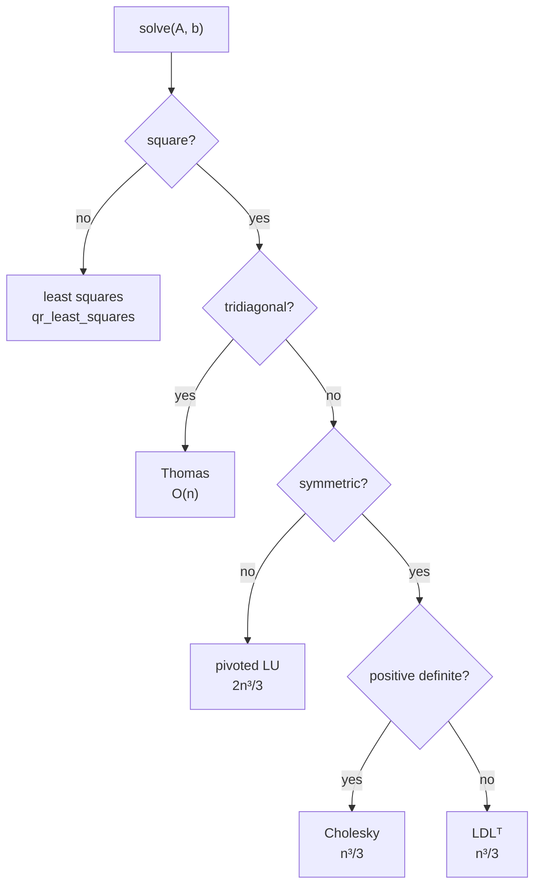

# Linear algebra

```python
from quadrivium.linalg import householder_qr, conjugate_gradient, randomized_svd
import quadrivium as qd          # qd.solve, qd.cholesky, qd.gmres, ...
```

124 routines covering direct solvers and factorizations, eigenvalue and
singular value problems, stationary and Krylov iterations, least squares,
sparse storage, matrix functions and matrix equations, and randomized
low-rank methods. Full signatures are in the
[`linalg` reference](../api/linalg.md).

## Solving `A x = b`

`solve` inspects the matrix and picks a factorization, which is the right
default when you do not want to think about it:

```pycon
>>> from quadrivium import numeric as np
>>> import quadrivium as qd
>>> A = np.array([[4.0, 1.0, 0.0], [1.0, 3.0, 1.0], [0.0, 1.0, 2.0]])
>>> b = np.array([1.0, 2.0, 3.0])
>>> x = qd.solve(A, b)
>>> float(np.max(np.abs(A @ x - b))) < 1e-14
True

```

It chooses Cholesky for a symmetric positive definite matrix, the Thomas
algorithm for a tridiagonal one, and pivoted LU otherwise. Pass `method=` to
override: `"lu"`, `"plu"`, `"cholesky"`, `"ldl"`, `"qr"`, `"thomas"`,
`"gauss"`.



The questions it asks are the public ones from
[`quadrivium.core`](core.md#shape-and-property-checks) — `is_symmetric`,
`is_positive_definite`, `is_diagonally_dominant` — so you can ask them
yourself before choosing a method by hand.

When the matrix has structure worth exploiting, or you need the factors
themselves, call the factorization directly:

| Matrix | Use | Cost |
| --- | --- | --- |
| general | `plu_decomposition`, `plu_solve` | 2n³/3 |
| general, several right-hand sides | `lu_decomposition` once, `lu_solve` per `b` | 2n³/3 + 2n² each |
| symmetric positive definite | `cholesky`, `cholesky_solve` | n³/3 |
| symmetric indefinite | `ldl_decomposition`, `ldl_solve` | n³/3 |
| tridiagonal | `thomas` | O(n) |
| banded, bandwidth `kl`/`ku` | `banded_solve` | O(n·kl·ku) |
| block tridiagonal | `block_tridiagonal_solve` | O(n·m³) |
| least squares, or ill-conditioned | `qr_solve`, `svd_least_squares` | 2mn² or more |
| rank-1 update of a known inverse | `sherman_morrison` | O(n²) |
| low-rank update of a known inverse | `woodbury` | O(n²k) |

Factorizations return their factors, and the factors reconstruct the matrix
exactly:

```pycon
>>> P, L, U = qd.plu_decomposition(A)
>>> float(np.max(np.abs(P @ A - L @ U))) < 1e-14
True
>>> R = qd.cholesky(A)                      # lower triangular by default
>>> float(np.max(np.abs(R @ R.T - A))) < 1e-14
True

```

### Pivoting

`gauss_elimination` exposes the choice that textbooks make and libraries hide:

```pycon
>>> from quadrivium.linalg import gauss_elimination
>>> for strategy in ("none", "partial", "scaled", "complete"):
...     x = gauss_elimination(A, b, pivoting=strategy)
...     print(strategy, float(np.max(np.abs(A @ x - b))) < 1e-13)
none True
partial True
scaled True
complete True

```

Partial pivoting is the default and is what `plu_decomposition` does.
`lu_complete_pivot` returns both row and column permutations, which matters
only for matrices constructed to defeat partial pivoting.

### QR: four algorithms, one answer

```pycon
>>> from quadrivium.linalg import (gram_schmidt_qr, modified_gram_schmidt_qr,
...                               householder_qr, givens_qr)
>>> M = np.array([[1.0, 2.0], [3.0, 4.0], [5.0, 6.0]])
>>> for qr in (gram_schmidt_qr, modified_gram_schmidt_qr, householder_qr, givens_qr):
...     Q, R = qr(M)
...     print(qr.__name__, float(np.max(np.abs(Q @ R - M))) < 1e-13)
gram_schmidt_qr True
modified_gram_schmidt_qr True
householder_qr True
givens_qr True

```

They differ in stability, not in what they compute. Classical Gram-Schmidt
loses orthogonality as the columns become dependent; the modified form loses
it more slowly; Householder and Givens are backward stable. Use
`householder_qr` unless you are studying the difference — and it is worth
studying, because on a nearly rank-deficient matrix classical Gram-Schmidt
produces a `Q` whose columns are visibly not orthogonal while Householder's
are orthogonal to machine precision. Givens is the one to reach for when the
matrix is already nearly triangular, since it can zero one entry at a time.

<figure markdown="span">
  
  
  <figcaption>Each algorithm factorizes the same nearly rank-deficient matrix. <code>max|QᵀQ − I|</code> ought to be zero: classical Gram-Schmidt loses it as the square of the condition number, the modified form as the first power, and the two orthogonal-transformation methods do not lose it at all.</figcaption>
</figure>

## Conditioning

Before trusting a solve, ask how much the answer can move:

```pycon
>>> from quadrivium.core import condition_number
>>> from quadrivium.linalg import condition_estimate, residual_analysis
>>> round(condition_number(A), 6)
3.732051
>>> hilbert = np.array([[1/(i + j + 1) for j in range(6)] for i in range(6)])
>>> condition_number(hilbert) > 1e7
True

```

`condition_estimate` is Hager's 1-norm estimator: O(n²) work per iteration
using only solves, which is how a production library reports a condition
number without forming an inverse.

`residual_analysis` returns the residual, its norm, the RMSE, R², the
covariance of the fit, standard errors, and the degrees of freedom — the whole
diagnostic set for a least squares solve in one call.

## Eigenvalues

| You want | Use |
| --- | --- |
| the dominant eigenpair | `power_iteration` |
| the eigenvalue nearest a shift `σ` | `inverse_power_iteration(A, sigma)` |
| very fast convergence from a good guess | `rayleigh_quotient_iteration` (cubic, for symmetric `A`) |
| all eigenvalues, symmetric | `jacobi_eigen` (accurate, simple) |
| all eigenvalues, general | `francis_qr` or `qr_algorithm` |
| a few extreme eigenvalues of a large symmetric matrix | `lanczos`, then `bisection_eigenvalues`; or `lobpcg` |
| a Krylov basis of a large nonsymmetric matrix | `arnoldi` |
| several eigenpairs at once | `subspace_iteration` |
| `A x = λ B x` with `B` positive definite | `generalized_eigh` |
| `A x = λ B x` with `B` singular | `qz_decomposition`, `qz_eigenvalues` |
| eigenvalue localisation without computing anything | `gershgorin_disks` |

```pycon
>>> S = np.array([[2.0, 1.0, 0.0], [1.0, 3.0, 1.0], [0.0, 1.0, 2.0]])
>>> ev = qd.jacobi_eigen(S)
>>> [round(float(v), 10) for v in sorted(ev.eigenvalues)]
[1.0, 2.0, 4.0]
>>> ev.converged
True
>>> dominant = qd.power_iteration(S)
>>> round(float(dominant.eigenvalues[0]), 10)
4.0

```

`EigenResult` unpacks as `(values, vectors)`, so the common case reads the way
you would write it by hand:

```pycon
>>> values, vectors = qd.jacobi_eigen(S)
>>> i = int(np.argmax(values))
>>> float(np.max(np.abs(S @ vectors[:, i] - values[i] * vectors[:, i]))) < 1e-12
True

```

Eigenvectors are returned as *columns*, matching `numpy.linalg.eig`.

<figure markdown="span">
  
  
  <figcaption>Each row gives a disk centred on its diagonal entry whose radius is the sum of the other magnitudes in that row, and every eigenvalue lies in one of them. The disks cost O(n²) additions and no factorization; the eigenvalues plotted inside them came from `francis_qr`.</figcaption>
</figure>

### Decompositions built on eigenvalues

`schur` gives the real Schur form (quasi-triangular, 2×2 blocks for complex
pairs), `hessenberg` the reduction that precedes it, `polar_decomposition` the
unitary-times-positive-semidefinite factorization, and `svd_jacobi` /
`svd_golub_kahan` the singular value decomposition:

```pycon
>>> U, s, Vt = qd.svd_jacobi(np.array([[1.0, 2.0], [3.0, 4.0], [5.0, 6.0]]))
>>> U.shape, s.shape, Vt.shape
((3, 2), (2,), (2, 2))
>>> float(np.max(np.abs(U @ np.diag(s) @ Vt - np.array([[1.0, 2.0], [3.0, 4.0], [5.0, 6.0]])))) < 1e-13
True

```

One-sided Jacobi (`svd_jacobi`) computes small singular values to high
*relative* accuracy, which Golub-Kahan does not guarantee; Golub-Kahan is the
faster of the two.

## Iterative solvers

For a large matrix — or an operator you can only apply, never form — the
Krylov methods take a matrix, or anything exposing `@` or `matvec`:

| Matrix | Method |
| --- | --- |
| symmetric positive definite | `conjugate_gradient`, or `preconditioned_cg` with `M` |
| symmetric indefinite | `minres` |
| nonsymmetric | `gmres` (robust, memory grows) or `bicgstab` (cheap, can stagnate) |
| nonsymmetric, short recurrence wanted | `bicg`, `cgs` |
| rectangular or least squares | `lsqr`, `cgnr` |
| diagonally dominant, simple splitting | `jacobi_iteration`, `gauss_seidel`, `sor` |

```pycon
>>> n = 200
>>> K = np.diag(2.0 * np.ones(n)) + np.diag(-np.ones(n - 1), 1) + np.diag(-np.ones(n - 1), -1)
>>> rhs = np.ones(n)
>>> res = qd.conjugate_gradient(K, rhs, tol=1e-12)
>>> res.converged, res.iterations < n
(True, True)
>>> float(np.max(np.abs(K @ res.x - rhs))) < 1e-10
True

```

<figure markdown="span">
  
  
  <figcaption>The residual history each solver returns, on the five-point Laplacian of a 16×16 grid. Both Krylov methods reach machine precision in fewer iterations than the matrix has rows; the stationary iterations are still going when the plot ends.</figcaption>
</figure>

`IterationResult.residuals` is the full convergence history, which is the
point of using these methods interactively:

```pycon
>>> len(res.residuals) == res.iterations + 1
True
>>> bool(res.residuals[-1] < res.residuals[0])
True

```

### Preconditioning

A preconditioner `M` approximates `A⁻¹` and is applied once per iteration.
Four are provided: `jacobi_preconditioner` (diagonal), `ssor_preconditioner`,
`incomplete_cholesky` (for SPD matrices), and `ilu0` (general, no fill-in).

```pycon
>>> from quadrivium.linalg import jacobi_preconditioner, preconditioned_cg
>>> D = np.diag(np.linspace(1.0, 500.0, 100))       # badly scaled but diagonal
>>> A_bad = D + np.eye(100)
>>> plain = qd.conjugate_gradient(A_bad, np.ones(100), tol=1e-10)
>>> pre = preconditioned_cg(A_bad, np.ones(100), M=jacobi_preconditioner(A_bad), tol=1e-10)
>>> pre.iterations < plain.iterations
True

```

<figure markdown="span">
  
  
  <figcaption>The same system, badly scaled on purpose: a diagonal rescaling of the Poisson matrix spanning four orders of magnitude. The preconditioner changes the iteration count by a factor of sixty, and the answer not at all.</figcaption>
</figure>

`sor` needs a relaxation parameter; `optimal_sor_omega` computes the value
that minimises the spectral radius of the iteration matrix for a consistently
ordered matrix, which is the classical result worth seeing hold:

```pycon
>>> from quadrivium.linalg import optimal_sor_omega, sor
>>> omega = optimal_sor_omega(K)
>>> bool(1.0 < omega < 2.0)
True
>>> fast = sor(K, rhs, omega=omega, tol=1e-10, max_iter=20000)
>>> slow = sor(K, rhs, omega=1.0, tol=1e-10, max_iter=20000)   # = Gauss-Seidel
>>> fast.iterations < slow.iterations
True

```

## Sparse matrices

Four storage formats, each with the operations it is good at: `COOMatrix`
(easy to build), `CSRMatrix` (fast row access and matrix-vector products),
`CSCMatrix` (fast column access), `DIAMatrix` (banded). `from_dense`,
`diags`, and `identity_sparse` construct them; `spmv` multiplies; every
Krylov solver accepts them directly.

```pycon
>>> from quadrivium.linalg import from_dense, spmv, sparsity, bandwidth
>>> Ksp = from_dense(K, fmt="csr")
>>> round(sparsity(Ksp), 4)                 # fraction of entries that are zero
0.985
>>> bandwidth(Ksp)
(1, 1)
>>> float(np.max(np.abs(spmv(Ksp, rhs) - K @ rhs))) < 1e-14
True
>>> qd.conjugate_gradient(Ksp, rhs, tol=1e-10).converged
True

```

`reverse_cuthill_mckee` reorders a symmetric sparse matrix to shrink its
bandwidth, which is what makes a banded direct solve affordable.

<figure markdown="span">
  
  
  <figcaption>The same 120×120 matrix with its rows and columns permuted. Nothing about the linear system changes; the bandwidth falls by more than half, and with it the cost of a banded solve.</figcaption>
</figure>

## Least squares

Nine estimators, differing in what they assume about the data:

| Problem | Use |
| --- | --- |
| well-conditioned, speed matters | `normal_equations` (squares the condition number — know that going in) |
| the default | `qr_least_squares` |
| rank-deficient or ill-conditioned | `svd_least_squares`, `pseudoinverse` |
| regularised, ridge penalty | `ridge_regression` |
| regularised with a smoothing operator | `tikhonov(A, b, alpha, L)` |
| regularised by truncating the spectrum | `truncated_svd(A, b, k)` |
| errors in `A` as well as `b` | `total_least_squares` |
| known measurement variances | `weighted_least_squares` |
| solution must be non-negative | `nonnegative_least_squares` |
| solution must satisfy `C x = d` | `constrained_least_squares` |
| large and sparse | `lsqr_least_squares` |

```pycon
>>> t = np.linspace(0, 1, 11)
>>> V = np.vstack([np.ones_like(t), t, t**2]).T
>>> y = 1 + 2*t + 3*t**2
>>> coef = qd.linalg.qr_least_squares(V, y)
>>> [round(float(c), 10) for c in coef]
[1.0, 2.0, 3.0]

```

<figure markdown="span">
  
  
  <figcaption>Fitting a polynomial of rising degree to data generated by that same polynomial, so the right answer is known exactly. The normal equations work with κ(V)², which reaches 1/ε — no digits left — around degree 12, where Cholesky then refuses the Gram matrix outright.</figcaption>
</figure>

Non-negativity is a real constraint, not a projection of the unconstrained
answer:

```pycon
>>> from quadrivium.linalg import nonnegative_least_squares
>>> Anq = np.array([[1.0, 0.0], [0.0, 1.0], [1.0, 1.0]])
>>> x_nn = nonnegative_least_squares(Anq, np.array([1.0, -1.0, 1.0]))
>>> bool(np.all(x_nn >= 0))
True

```

## Matrix functions and matrix equations

```pycon
>>> B = np.array([[4.0, 1.0], [2.0, 3.0]])
>>> S12 = qd.sqrtm(B)
>>> float(np.max(np.abs(S12 @ S12 - B))) < 1e-12
True
>>> float(np.max(np.abs(qd.linalg.matrix_exponential(qd.logm(B)) - B))) < 1e-9
True

```

`sqrtm` uses the scaled Denman-Beavers iteration and `logm` inverse scaling
and squaring; `signm` gives the matrix sign function; `matrix_function(A, f)`
applies any scalar function through the Schur form.

The matrix equations are solved by Bartels-Stewart rather than by forming the
Kronecker system, which is the difference between O(n³) and O(n⁶):

```pycon
>>> Asy = np.array([[1.0, 2.0], [0.0, 3.0]])
>>> Bsy = np.array([[2.0, 0.0], [1.0, 4.0]])
>>> C = np.eye(2)
>>> X = qd.sylvester(Asy, Bsy, C)                 # A X + X B = C
>>> float(np.max(np.abs(Asy @ X + X @ Bsy - C))) < 1e-12
True
>>> Astable = np.array([[-2.0, 1.0], [0.0, -3.0]])
>>> Q = np.eye(2)
>>> Y = qd.lyapunov(Astable, Q)                   # A Y + Y Aᵀ + Q = 0
>>> float(np.max(np.abs(Astable @ Y + Y @ Astable.T + Q))) < 1e-12
True

```

`discrete_lyapunov` solves `A X Aᵀ − X + Q = 0` by doubling, and `care_newton`
the continuous algebraic Riccati equation by Newton-Kleinman — the equation
behind the linear quadratic regulator.

## Randomized methods

For a matrix that is large but numerically low rank, randomized methods get
within a small factor of the optimal approximation for a fraction of the work:

```pycon
>>> rng = np.random.default_rng(0)
>>> L = rng.standard_normal((300, 8)) @ rng.standard_normal((8, 200))   # rank 8
>>> U, s, Vt = qd.randomized_svd(L, k=8, rng=0)
>>> float(np.max(np.abs(U @ np.diag(s) @ Vt - L))) < 1e-8
True

```

<figure markdown="span">
  
  
  <figcaption>A 200×160 matrix of numerical rank 40. The sampled singular values sit on the exact ones, and the rank-k approximation lands within a few percent of the Eckart-Young optimum — the best any rank-k matrix can do — for a fraction of a full SVD's work.</figcaption>
</figure>

`randomized_range_finder`, `randomized_eigh`, `nystrom_approximation`,
`interpolative_decomposition`, and `cur_decomposition` complete the family.
The last two select actual rows and columns of `A`, so the factors keep the
meaning of the original data — the reason to prefer them over an SVD when the
columns are measurements of something.

## Pitfalls

- **`normal_equations` squares the condition number.** For a Vandermonde
  matrix on more than a handful of points, the answer will have lost most of
  its digits. Use `qr_least_squares`.
- **Classical Gram-Schmidt loses orthogonality.** It is here to be compared
  against, not to be used.
- **Stationary iterations need a condition to converge.** Jacobi and
  Gauss-Seidel converge for diagonally dominant or SPD matrices;
  `is_diagonally_dominant` from `quadrivium.core` checks the easy case, and a
  non-converging run returns `converged=False` rather than looping forever.
- **CG requires symmetry and positive definiteness.** On a nonsymmetric
  matrix it may appear to converge to the wrong answer. Use `gmres`.
- **`power_iteration` needs a dominant eigenvalue.** With a complex conjugate
  pair of equal modulus it will not settle; use `francis_qr`.
- **The QR algorithm on a nonsymmetric matrix returns complex eigenvalues.**
  Real Schur form keeps 2×2 blocks; `schur_eigenvalues` extracts the complex
  pairs from them.

## See also

- [`linalg` API reference](../api/linalg.md) — every signature.
- [Optimization guide](optimize.md) — least squares as an optimization problem
  (`gauss_newton`, `levenberg_marquardt`, `curve_fit`).
- [PDE guide](pde.md) — where these solvers are put to work on grids.
- `examples/01_linear_algebra.py` — a runnable tour.
