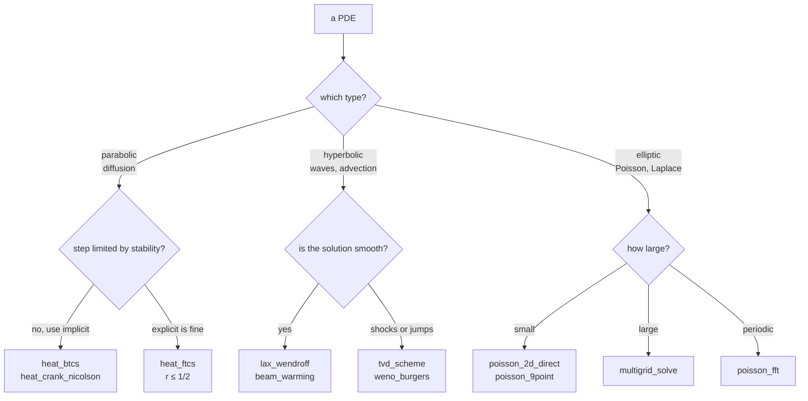

# Partial differential equations

```python
from quadrivium.pde import heat_crank_nicolson, multigrid_solve, weno_burgers
import quadrivium as qd          # qd.poisson_2d_direct, qd.navier_stokes_2d, ...
```

72 routines across the three classical types — parabolic, hyperbolic, elliptic
— plus multigrid, finite elements, finite volumes, spectral methods,
high-resolution schemes, and an incompressible Navier-Stokes solver. Full
signatures are in the [`pde` reference](../api/pde.md).

Solvers return a `PDESolution` carrying `u`, the coordinate `grids`, the time
levels `t` where there are any, and the residual history for iterative solvers.



## Parabolic: diffusion

```pycon
>>> import numpy as np
>>> import quadrivium as qd
>>> u0 = lambda x: np.sin(np.pi * x)
>>> sol = qd.heat_crank_nicolson(u0, 0.1, (0, 1), (0, 0.5), nx=50, nt=100)
>>> sol.u.shape                              # (time levels, grid points)
(101, 51)
>>> x = sol.grids[0]
>>> exact = np.exp(-0.1 * np.pi**2 * 0.5) * np.sin(np.pi * x)
>>> float(np.max(np.abs(sol.u[-1] - exact))) < 1e-4
True

```

<figure markdown="span">
  
  
  <figcaption>The dotted curves are exp(−απ²t)·sin(πx), the exact solution of the problem being solved. Crank-Nicolson is second order in time and unconditionally stable, so refining the grid lowers the error without any constraint on the step.</figcaption>
</figure>

| Scheme | Function | Stability | Order in time |
| --- | --- | --- | --- |
| forward Euler (FTCS) | `heat_ftcs` | conditional, `r ≤ 1/2` | 1 |
| backward Euler (BTCS) | `heat_btcs` | unconditional | 1 |
| Crank-Nicolson | `heat_crank_nicolson` | unconditional | 2 |
| θ-method | `heat_theta` | unconditional for `θ ≥ 1/2` | 2 at `θ = 1/2` |
| 2-D, direction split | `heat_2d_adi` | unconditional | 2 |
| semi-discrete | `method_of_lines` | whatever the ODE solver gives | ODE solver's |

The stability condition is not advice — an explicit scheme above it diverges,
so `heat_ftcs` refuses the step and says what would work:

```pycon
>>> from quadrivium.core import DomainError
>>> try:
...     qd.pde.heat_ftcs(u0, 0.1, (0, 1), (0, 0.5), nx=50, nt=10)
... except DomainError as exc:
...     print(exc)
FTCS is unstable for r = 12.5000 > 1/2; use nt >= 250 steps, or an implicit scheme such as heat_btcs / heat_crank_nicolson

```

`stability_ratio(alpha, dt, dx)` computes `r` directly. `diffusion_reaction`
and `advection_diffusion` add the other two terms; `method_of_lines`
discretizes space only and hands the resulting ODE system to any solver from
[`quadrivium.ode`](ode.md).

<figure markdown="span">
  
  
  <figcaption>The initial data carries a 2% component at the shortest wavelength the grid can hold — as any real data does. Below r = 1/2 it decays; at exactly 1/2 it neither grows nor decays; at 0.52 it grows by twenty orders of magnitude, which is why `heat_ftcs` refuses the step rather than returning it.</figcaption>
</figure>

## Hyperbolic: waves and advection

Twelve schemes for the same equation, because their failure modes differ and
that is the whole subject:

```pycon
>>> square = lambda x: np.where(np.abs(x - 0.3) < 0.1, 1.0, 0.0)
>>> from quadrivium.pde import lax_wendroff, advection_upwind, tvd_scheme
>>> lw = lax_wendroff(square, 1.0, (0, 1), (0, 0.2), nx=200, nt=400)
>>> tvd = tvd_scheme(square, 1.0, (0, 1), (0, 0.2), nx=200, nt=400, limiter="van_leer")
>>> float(np.min(lw.u[-1])) < -0.02          # second order: oscillates
True
>>> float(np.min(tvd.u[-1])) > -1e-9         # TVD limiter: no new extrema
True

```

That is the Godunov barrier in one example: a linear scheme of second order or
higher cannot be monotone. Upwind is monotone but smears the discontinuity;
Lax-Wendroff is sharp but oscillates; a flux limiter switches between them
locally and gets both.

<figure markdown="span">
  
  
  <figcaption>After one transit of the domain: upwind has smeared the jump over twenty cells but stayed monotone, Lax-Wendroff has kept it sharp and acquired oscillations of 27% below zero, and the van Leer limiter has kept the sharpness without the overshoot.</figcaption>
</figure>

`flux_limiter(r, kind)` exposes the seven limiters (`minmod`, `van_leer`,
`superbee`, `mc`, `koren`, `ospre`, `van_albada`), all of which lie inside
Sweby's TVD region.

| Problem | Function |
| --- | --- |
| second-order wave equation | `wave_explicit`, `wave_implicit` |
| linear advection, first order | `advection_upwind`, `lax_friedrichs` |
| linear advection, second order | `lax_wendroff`, `beam_warming`, `maccormack`, `leapfrog_advection` |
| discontinuous data | `tvd_scheme`, `weno_conservation_law` |
| nonlinear conservation law (shocks) | `godunov_burgers`, `weno_burgers`, `fvm_1d_conservation` |
| finite volume with reconstruction | `fvm_muscl`, with `rusanov_flux` or `hll_flux` |

WENO reconstruction with SSP Runge-Kutta time stepping is the high-order
answer for shocks: fifth-order accurate where the solution is smooth, and
non-oscillatory across a discontinuity.

```pycon
>>> from quadrivium.pde import weno_burgers
>>> smooth = lambda x: 0.5 + np.sin(2*np.pi*x)
>>> b = weno_burgers(smooth, (0, 1), (0, 0.3), nx=128, cfl=0.4)
>>> bool(np.all(np.isfinite(b.u[-1]))), float(np.max(b.u[-1])) <= 1.6
(True, True)

```

## Elliptic: Poisson and Laplace

```pycon
>>> f = lambda x, y: -2 * np.pi**2 * np.sin(np.pi*x) * np.sin(np.pi*y)
>>> p = qd.poisson_2d_direct(f, (0, 1), (0, 1), nx=40, ny=40)
>>> X, Y = np.meshgrid(p.grids[0], p.grids[1], indexing="ij")
>>> float(np.max(np.abs(p.u - np.sin(np.pi*X) * np.sin(np.pi*Y)))) < 1e-3
True

```

<figure markdown="span">
  
  
  <figcaption>A manufactured solution, so the error is known exactly. The five-point stencil is second order and the Mehrstellen nine-point stencil fourth: at h = 1/40 that is the difference between 1e-3 and 1e-6, for the same sparsity pattern.</figcaption>
</figure>

The five-point stencil is second order; `poisson_9point` uses the fourth-order
Mehrstellen stencil; `poisson_fft` solves the periodic problem in `O(n² log n)`
by diagonalizing the difference operator exactly; `poisson_neumann` handles
pure-Neumann boundaries with ghost points, which is what keeps it second order
where a one-sided difference would not.

For large grids, iterating is cheaper than a direct solve — and multigrid
iterates in a way whose cost is proportional to the number of unknowns,
independent of how fine the grid is:

```pycon
>>> mg = qd.multigrid_solve(f, (0, 1), (0, 1), n=64, tol=1e-10)
>>> mg.converged, mg.iterations < 15          # V-cycles, not sweeps
(True, True)

```

`v_cycle`, `w_cycle`, and `full_multigrid` are the cycles themselves;
`restrict`, `prolong`, `smooth`, and `residual` are the components, exposed so
the algorithm can be assembled or inspected. `poisson_2d_iterative` runs
plain Jacobi, Gauss-Seidel, SOR, or CG for comparison — which is the way to see
what multigrid buys.

<figure markdown="span">
  
  
  <figcaption>A single-grid iteration removes the high-frequency error quickly and then crawls; multigrid moves the low frequencies to a coarse grid where they are high frequencies again. The count of V-cycles is flat in the mesh size, which is the property that matters.</figcaption>
</figure>

## Finite elements

```pycon
>>> from quadrivium.pde import fem_1d_linear
>>> # -u'' = 1 on (0,1), u(0) = u(1) = 0  →  u = x(1-x)/2
>>> fem = fem_1d_linear(lambda x: 1.0, (0, 1), bc=(0.0, 0.0), n=20)
>>> xs = fem.grids[0]
>>> float(np.max(np.abs(fem.u - xs*(1 - xs)/2))) < 1e-12
True

```

P1 elements are nodally exact in 1-D for this problem — the error at the nodes
is machine precision, not `O(h²)` — which is a property of the Galerkin
projection, not a coincidence. `fem_1d_quadratic` uses P2 elements,
`fem_2d_triangular` solves on a triangular mesh (`unit_square_mesh` builds
one), `assemble_1d` and `fem_1d_mass_stiffness` expose the element matrices,
and `fem_1d_time_dependent` adds a θ-scheme in time.

## Spectral methods

For periodic problems on smooth data, spectral methods converge faster than
any fixed order:

```pycon
>>> from quadrivium.pde import fourier_heat
>>> n = 64
>>> xs = np.linspace(0, 2*np.pi, n, endpoint=False)
>>> sol = fourier_heat(np.sin(xs), 0.1, L=2*np.pi, n=n, t_span=(0, 1), nt=100)
>>> decay = float(np.exp(-0.1))
>>> float(np.max(np.abs(sol.u[-1] - decay * np.sin(xs)))) < 1e-10
True

```

`chebyshev_poisson_1d` and `chebyshev_bvp` do the non-periodic case;
`spectral_burgers` includes dealiasing; `kuramoto_sivashinsky` integrates the
canonical chaotic PDE with an exponential time-differencing scheme.

<figure markdown="span">
  
  
  <figcaption>Smooth initial data steepens until the solution becomes discontinuous, and then keeps travelling. WENO5 is fifth order where the solution is smooth and drops its stencil where it is not, so the jump stays within a cell or two and no oscillation appears beside it.</figcaption>
</figure>

## Incompressible Navier-Stokes

`navier_stokes_2d` uses Chorin projection: advance momentum, then project onto
the divergence-free space by solving a pressure Poisson equation. The FFT
solver inverts the symbol of the *exact* difference operators used elsewhere in
the step, so the resulting velocity is divergence-free to `10⁻¹⁶` rather than
`10⁻⁵`.

`vorticity_streamfunction` is the pseudo-spectral alternative, and
`lid_driven_cavity` solves the standard benchmark — it reproduces Ghia, Ghia
and Shin (1982) to within 1% at Re = 100.

<figure markdown="span">
  
  
  <figcaption>Streamlines of the steady solution, with the primary vortex centre marked, and the three numbers the benchmark reports. The agreement is the whole point: this is a solver checked against a published result, not against itself.</figcaption>
</figure>

## Pitfalls

- **Explicit schemes have step limits, and exceeding them diverges.**
  Diffusion needs `α Δt/Δx² ≤ 1/2`; advection needs `CFL = |c| Δt/Δx ≤ 1`.
  `cfl_number` and `stability_ratio` compute them.
- **Second-order schemes oscillate at discontinuities.** That is Godunov's
  theorem, not a bug. Use a limiter or WENO.
- **Unconditional stability is not accuracy.** Crank-Nicolson is stable at any
  step, but at a large step it rings rather than damping — a sharp initial
  condition will oscillate in time. Use `heat_theta` with `θ ≈ 0.6`, or BTCS.
- **A pure Neumann problem is singular.** The solution is defined only up to a
  constant, and the data must satisfy a compatibility condition.
- **Spectral accuracy needs smoothness and periodicity.** Neither one alone
  suffices; a jump gives Gibbs oscillations that do not shrink with `n`.

## See also

- [`pde` API reference](../api/pde.md) — every signature.
- [ODE guide](ode.md) — the time integrators behind method of lines.
- [Linear algebra guide](linalg.md) — the sparse and Krylov solvers used at
  each implicit step.
- [Transforms guide](transforms.md) — the FFT behind the spectral solvers.
- `examples/05_pde_and_transforms.py` — a runnable tour.
