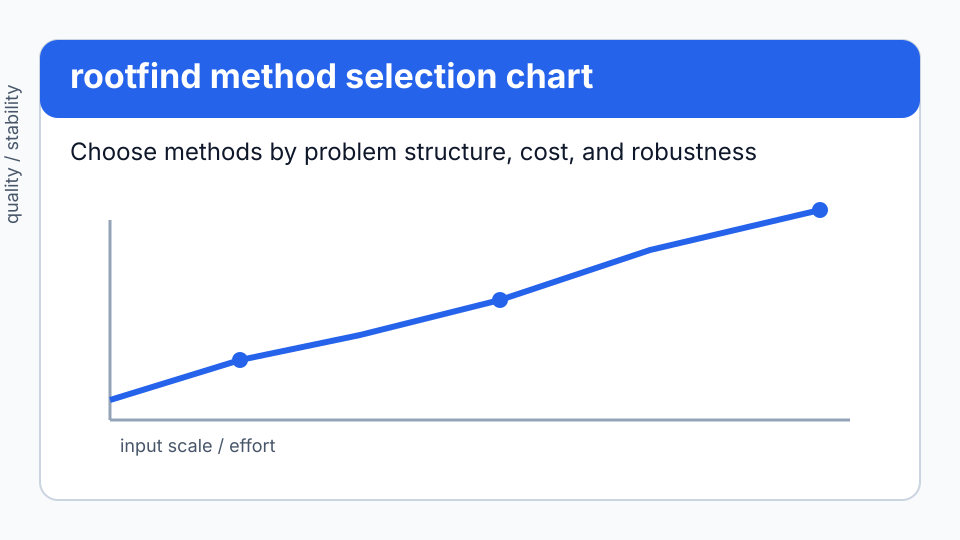
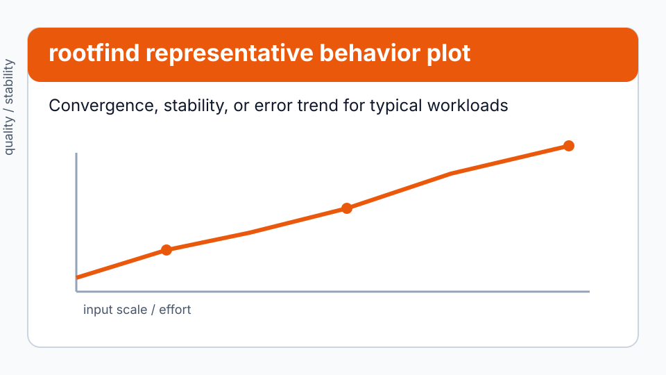

# Root finding

```python
from quadrivium.rootfind import brent, newton_system, polynomial_roots
import quadrivium as qd          # qd.brent, qd.newton, qd.newton_krylov, ...
```

## Problem framing

Use this guide when the main challenge is selecting robust `rootfind` routines for a specific numerical workload while balancing stability, accuracy, and cost.


45 routines for `f(x) = 0`: eighteen for scalar equations, twelve for systems,
and fifteen for polynomials, where the structure permits methods the general
case cannot use. Full signatures are in the
[`rootfind` reference](../api/rootfind.md).

## Choosing a scalar method

The first question is whether you have a bracket — an interval `[a, b]` with
`f(a)` and `f(b)` of opposite signs. With one, convergence is guaranteed.

| Situation | Method | Order |
| --- | --- | --- |
| you have a bracket and want the default | `brent` | superlinear, never worse than bisection |
| bracket, want a modern alternative with a proved bound | `itp` | superlinear, bisection-competitive worst case |
| bracket, want the simplest possible thing | `bisection` | 1 (linear, exactly one bit per step) |
| bracket, `f` nearly linear | `illinois`, `pegasus` | ~1.44–1.7 |
| bracket, `f` smooth and expensive | `ridders` | 2 |
| no bracket, `f'` available | `newton` | 2 |
| no bracket, `f'` and `f''` available | `halley`, `chebyshev_method` | 3 |
| no bracket, no derivative | `secant` | 1.618 |
| no derivative, no second point | `steffensen` | 2 |
| complex roots wanted from real arithmetic | `muller` | 1.84 |
| the problem is naturally `x = g(x)` | `fixed_point`, `aitken_accelerated` | 1, accelerated |

```pycon
>>> import numpy as np
>>> import quadrivium as qd
>>> f = lambda x: x**3 - 2*x - 5
>>> r = qd.brent(f, 1, 3)
>>> round(r.root, 12), r.converged, r.iterations < 15
(2.094551481542, True, True)

```

Every method reports its cost, which is how you compare them honestly — by
function evaluations, not by iterations:

```pycon
>>> from quadrivium.rootfind import bisection, ridders, illinois, brent
>>> for method in (bisection, illinois, ridders, brent):
...     res = method(f, 1, 3, tol=1e-12)
...     print(f"{res.method:10s} {res.iterations:3d} iterations {res.function_calls:3d} calls")
bisection   41 iterations  43 calls
illinois     8 iterations  10 calls
ridders      4 iterations  10 calls
brent       10 iterations  11 calls

```

### Finding a bracket

`bracket_root` expands an interval outward until it finds a sign change, and
`find_all_roots` scans a grid and refines every sign change it sees — the
practical way to start when you know nothing about the function:

```pycon
>>> from quadrivium.rootfind import bracket_root, find_all_roots
>>> a, b = bracket_root(lambda x: x**2 - 9, 0.0, 1.0)
>>> float(a) <= 3.0 <= float(b)
True
>>> roots = find_all_roots(lambda x: np.sin(x), 0.5, 10.0)
>>> [round(float(x), 8) for x in roots]
[3.14159265, 6.28318531, 9.42477796]

```

A grid scan finds only the sign changes it lands on. Two roots inside one grid
cell, or a root the function only touches without crossing, will be missed —
raise `n` when the function oscillates.

### When Newton misbehaves

Newton's method converges quadratically near a simple root and can fail
everywhere else. Two arguments handle the common failures:

```pycon
>>> qd.newton(lambda x: x**3 - 2*x - 5, 2.0, lambda x: 3*x**2 - 2).iterations
4

```

`damping=` scales the step, which tames the overshoot that sends a Newton
iterate off to infinity. `multiplicity=m` restores quadratic convergence at a
root of multiplicity `m`, where plain Newton degrades to linear:

```pycon
>>> g = lambda x: (x - 1)**3               # a triple root
>>> dg = lambda x: 3*(x - 1)**2
>>> plain = qd.newton(g, 2.0, dg, tol=1e-12)
>>> fixed = qd.newton(g, 2.0, dg, tol=1e-12, multiplicity=3)
>>> fixed.iterations < plain.iterations
True
>>> round(fixed.root, 12)
1.0

```

Without a derivative, `newton` falls back to a finite difference, so it always
runs; supplying `df` is faster and more accurate.

## Systems of equations

```pycon
>>> def F(x):
...     return np.array([x[0]**2 + x[1]**2 - 4, x[0] - x[1]])
>>> res = qd.newton_system(F, [1.0, 0.5])
>>> [round(float(v), 10) for v in res.root]
[1.4142135624, 1.4142135624]
>>> res.converged
True

```

| Situation | Method |
| --- | --- |
| Jacobian available and cheap | `newton_system` |
| Newton diverges from your starting point | `damped_newton_system` (backtracking line search) |
| Jacobian expensive | `broyden_good` (rank-1 update), `broyden_bad` |
| no Jacobian at all | `secant_system` |
| structure is `x = G(x)` | `fixed_point_system`, `anderson_acceleration` |
| the problem is decoupled by variable | `nonlinear_gauss_seidel` |
| no good starting point exists | `continuation`, `homotopy` |
| far from the solution, want global convergence | `trust_region_dogleg_root` |
| Jacobian too large to form | `newton_krylov` |

Anderson acceleration is the general-purpose way to speed up any fixed-point
iteration you already have, without changing it:

```pycon
>>> G = lambda x: np.cos(x)                     # x = cos(x)
>>> plain = qd.rootfind.fixed_point_system(G, [1.0], tol=1e-12)
>>> fast = qd.anderson_acceleration(G, [1.0], tol=1e-12)
>>> fast.converged and fast.iterations < plain.iterations
True
>>> round(float(fast.root[0]), 10)
0.7390851332

```

### Jacobian-free Newton-Krylov

When the Jacobian is too large to form — a discretized PDE, say —
`newton_krylov` never builds it. The Newton step is solved by restarted GMRES
using only directional derivatives, each of which is one extra evaluation of
`F`:

```pycon
>>> n = 50                                    # 1-D Bratu problem
>>> h = 1.0 / (n + 1)
>>> def bratu(u):
...     lap = np.zeros(n)
...     up = np.concatenate(([0.0], u, [0.0]))
...     lap = (up[:-2] - 2*up[1:-1] + up[2:]) / h**2
...     return lap + 3.0 * np.exp(u)
>>> res = qd.newton_krylov(bratu, np.zeros(n), tol=1e-10)
>>> res.converged, float(np.max(np.abs(bratu(res.root)))) < 1e-8
(True, True)

```

Unpreconditioned, the number of Krylov iterations grows as the mesh is
refined; that is a property of the operator, not of the implementation. Pass
`precond=` — a callable or matrix approximating `J⁻¹` — to fix it. On `n = 1000`
Bratu, preconditioning takes the cost from 102,101 residual evaluations to 21.

## Polynomials

A polynomial's structure allows all roots at once, exact deflation, and
counting real roots without finding them. Coefficients run highest degree
first, matching `numpy.polyval`.

```pycon
>>> coeffs = [1.0, -6.0, 11.0, -6.0]                # x³ - 6x² + 11x - 6
>>> roots = qd.polynomial_roots(coeffs)
>>> sorted(round(float(np.real(z)), 10) for z in roots)
[1.0, 2.0, 3.0]

```

| Method | Finds | Note |
| --- | --- | --- |
| `companion_roots` | all roots | the standard approach; `polynomial_roots` default |
| `durand_kerner` | all roots at once | simultaneous iteration, quadratic |
| `aberth_ehrlich` | all roots at once | cubic; the fastest of the simultaneous methods |
| `laguerre_root` | one root | cubic for simple roots, very robust |
| `bairstow` | quadratic factors | complex pairs without complex arithmetic |
| `jenkins_traub_like` | all roots | Laguerre plus deflation |
| `newton_polynomial` | one root | Newton via Horner, two evaluations per step |

Supporting machinery: `horner` and `horner_derivative` evaluate in `n`
multiplications, `synthetic_division` and `deflate` remove a known root,
`root_bounds` gives Cauchy and Fujiwara bounds on the moduli, and Sturm
sequences count real roots in an interval exactly:

```pycon
>>> from quadrivium.rootfind import count_real_roots, root_bounds, horner
>>> count_real_roots(coeffs, 0.0, 2.5)              # roots at 1 and 2
2
>>> round(float(horner(coeffs, 2.0)), 12)
0.0
>>> bounds = root_bounds(coeffs)
>>> sorted(bounds)
['cauchy', 'fujiwara', 'lower']
>>> all(bounds["lower"] - 1e-12 <= abs(z) <= bounds["cauchy"] + 1e-12 for z in roots)
True

```

## Reading the result

`RootResult` carries the root, the residual there, the iteration count, the
function-call count, the full iterate history, and a message:

```pycon
>>> r = qd.brent(f, 1, 3)
>>> abs(r.f_root) < 1e-13
True
>>> r.history[0] != r.history[-1] and len(r.history) == r.iterations
True
>>> r.message
'converged'

```

## Visual evidence



*Figure: Method-selection map for `rootfind` routines by problem class and constraints. See the [rootfind API reference](../api/rootfind.md).* 



*Figure: Representative behavior (convergence, error, or stability trend) for key `rootfind` methods.*

## Pitfalls

- **A bracket is a promise; check it exists.** Bracketing methods raise
  `BracketError` when `f(a)` and `f(b)` share a sign, rather than returning
  nonsense.
- **`f(a)·f(b) < 0` finds one root, not all of them.** An even number of roots
  in the interval leaves the signs unchanged. Use `find_all_roots` or
  `count_real_roots`.
- **Newton without a bracket can leave the region entirely.** If it does, the
  result comes back with `converged=False`; use `damped_newton_system` or a
  bracketing method rather than a better initial guess you do not have.
- **A tolerance on `x` is not a tolerance on `f(x)`.** Near a multiple root,
  `f` is flat: `|f(x)| < 1e-16` can hold while `x` is wrong in the fourth
  decimal. Check both, which is why `f_root` is returned.
- **Steffensen squares the function's scale.** It evaluates `f(x + f(x))`, so
  a large `f` takes it far away. It is best on functions already near their
  root.

## API links

- [`quadrivium.rootfind` API overview](../api/rootfind.md)
- [API index](../api/index.md)

## Next steps

- Start with one representative problem and validate with the diagnostics shown in this guide.
- Compare at least two candidate methods from the selection table before scaling up.
- Follow links to neighboring guides when the problem mixes multiple method families.

## See also

- [`rootfind` API reference](../api/rootfind.md) — every signature.
- [Optimization guide](optimize.md) — minimizing `‖F(x)‖²` when a root does not
  exist, and finding stationary points instead of roots.
- [Approximation guide](approx.md) — `aaa` and Padé, whose poles and zeros are
  found this way.
