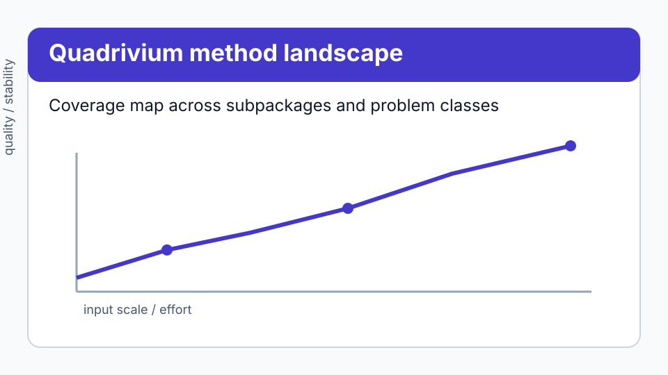
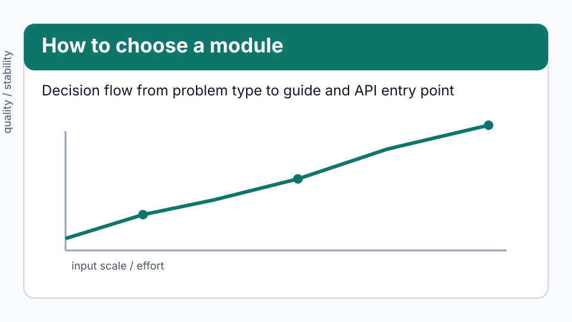

# Quadrivium

A comprehensive, from-scratch library of the numerical methods used in
scientific computing. Every algorithm is written out explicitly — LU
factorization loops over its pivots, the FFT does its own bit reversal, the
Hungarian algorithm walks its own augmenting paths — so the method itself is
readable rather than hidden behind a compiled call.

**836 public functions and classes across 13 subpackages. 370 tests, all
passing. Depends only on NumPy.**

*The quadrivium was the medieval curriculum of the four mathematical arts —
arithmetic, geometry, music, astronomy — the complete education in number.
It abbreviates to **quad**.*

```bash
pip install quadrivium
```

```python
import numpy as np
import quadrivium as qd

qd.brent(lambda x: x**3 - 2*x - 5, 1, 3).root      # 2.0945514815423265
qd.quad(lambda x: np.exp(-x*x), -np.inf, np.inf)   # sqrt(pi), to 5e-15
qd.solve_ivp(lambda t, y: -2*y, (0, 1), [1.0])     # adaptive Dormand-Prince
qd.minimize(rosenbrock, [-1.2, 1.0], method="bfgs")
```

## Where to start

<div class="grid cards" markdown>

- **[Installation](installation.md)** — pip, from source, and what the version
  requirements actually are.
- **[Getting started](getting-started.md)** — the first twenty minutes: calling
  conventions, result records, tolerances, and how failure is reported.
- **[Guides](guides/linalg.md)** — one per subpackage, on choosing between
  methods that solve the same problem.
- **[API reference](api/index.md)** — all 836 public names with real signatures,
  generated from the package itself.

</div>

## Visual orientation



*Figure: High-level map of numerical method families and where each subpackage fits.*



*Figure: Fast decision path from a problem statement to the right guide and API section.*

## Who this is for

Three audiences, in order of how well the library serves them:

**People learning the methods.** Every algorithm is visible in the source at
the level a textbook describes it, and the tests check the properties the
theory promises — convergence orders, exactness degrees, conservation laws — so
you can watch a claim hold and then break it by changing a parameter.

**People who need a method that a general-purpose library does not expose.**
Bairstow's method, Sturm sequences, the ITP root finder, Filon quadrature for
oscillatory integrands, Hadamard finite parts, PEFRL integration, the dual
lattice spectral test, Gragg-Bulirsch-Stoer with adaptive order, adaptive
rejection sampling — these exist here as first-class functions.

**People who want the intermediate results.** Iteration histories, residual
norms, function-call counts, per-step error estimates and convergence flags
come back with every answer rather than being discarded.

If what you need is the fastest possible solve of a large sparse system, use a
compiled library — see [Performance](getting-started.md#performance) for an
honest account of the trade-off.

## What is in it

| Subpackage | Guide | Covers |
| --- | --- | --- |
| `core` | [core](guides/core.md) | Result records, exceptions, norms, numerical derivatives |
| `linalg` | [linalg](guides/linalg.md) | Factorizations, eigenvalues, Krylov solvers, least squares, sparse storage, matrix functions and equations, randomized methods |
| `rootfind` | [rootfind](guides/rootfind.md) | Scalar equations, nonlinear systems, polynomial roots |
| `interpolate` | [interpolate](guides/interpolate.md) | Polynomial, spline, rational, and multivariate interpolation |
| `approx` | [approx](guides/approx.md) | Orthogonal polynomials, Gauss nodes, least squares, Padé, minimax, Fourier |
| `diff` | [diff](guides/diff.md) | Finite differences, automatic differentiation, spectral differentiation |
| `integrate` | [integrate](guides/integrate.md) | Newton-Cotes, Gauss, adaptive, Monte Carlo, oscillatory, singular, multidimensional |
| `ode` | [ode](guides/ode.md) | One-step, multistep, symplectic, exponential, extrapolation, events, BVPs, DAEs, delay equations |
| `pde` | [pde](guides/pde.md) | Parabolic, hyperbolic, elliptic, multigrid, FEM, FVM, spectral, WENO, Navier-Stokes |
| `optimize` | [optimize](guides/optimize.md) | Line searches, quasi-Newton, trust region, derivative-free, global, constrained, proximal, LP |
| `transforms` | [transforms](guides/transforms.md) | DFT/FFT family, signal processing, wavelets |
| `stochastic` | [stochastic](guides/stochastic.md) | Random generation, sampling, MCMC, statistics, SDE solvers |
| `special` | [special](guides/special.md) | Gamma, Bessel, Airy, elliptic, hypergeometric, Lambert W, zeta, spherical harmonics |

## A result is a record, not a bare number

Every solver returns a small record carrying the answer together with the
evidence for it:

```pycon
>>> import quadrivium as qd
>>> result = qd.brent(lambda x: x**3 - 2*x - 5, 1, 3)
>>> round(result.root, 12)
2.094551481542
>>> result.converged
True
>>> result.iterations <= 12
True
>>> result.method
'brent'

```

The records are [documented in full](getting-started.md#result-records):
`RootResult`, `IterationResult`, `QuadratureResult`, `ODESolution`,
`OptimizeResult`, `EigenResult`, `PDESolution`.

## Design

The library is built on four commitments, described at length in
[Design and validation](design.md):

1. **Every claim is tested against something independent** — an analytic
   solution, an exact identity, a convergence rate, or a published benchmark.
2. **Failures are reported, not hidden.** A diverging iteration returns
   `converged=False` with a message, rather than raising on overflow.
3. **Numerical care is explicit.** Where the naive formula is wrong, the code
   says why and uses the stable one.
4. **Real limitations are documented** rather than papered over. See
   [Known limitations](limitations.md).

## Project

- Source: [github.com/ssmmkk123/quadrivium](https://github.com/ssmmkk123/quadrivium)
- Issues: [github.com/ssmmkk123/quadrivium/issues](https://github.com/ssmmkk123/quadrivium/issues)
- Changelog: [CHANGELOG](changelog.md)
- License: [MIT](https://github.com/ssmmkk123/quadrivium/blob/main/LICENSE)
